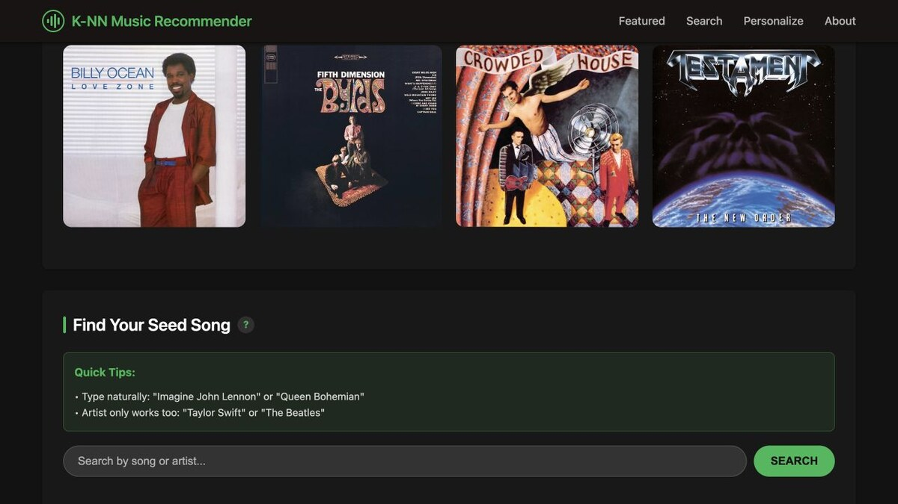
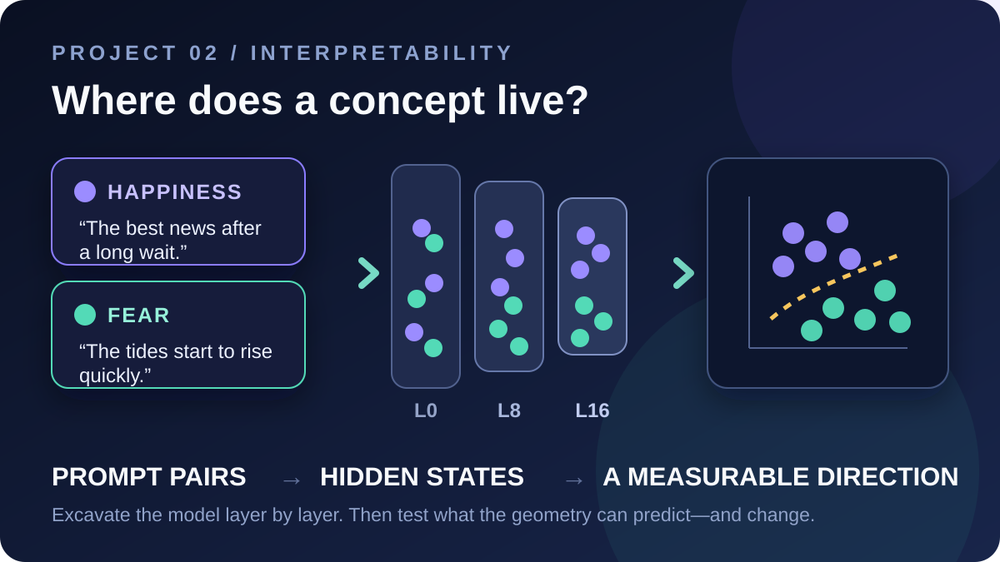
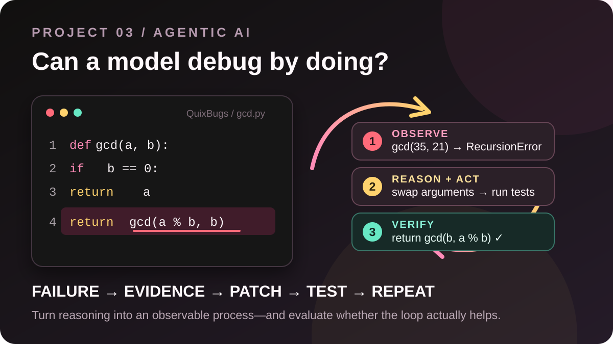

<div align="center">
  <br>
  <h1>Machine Learning,<br>from the inside out.</h1>
  <p><strong>See the model. Stress the assumptions. Understand the behavior.</strong></p>
  <p><code>NOTEBOOKS → VISUAL EXPERIMENTS → PROJECTS → QUESTIONS</code></p>
  <br>
</div>

<p align="center">
  <a href="https://jinming.tech/learn-ml-by-building/"></a>
  
  
  <a href="LICENSE"></a>
</p>

---

This repository is [Ming Jin's](https://jinming.tech/) workshop floor for **ECE 4424 / CS 4824: Machine Learning**. The notebooks favor experiments, visual explanations, and real systems over long stretches of passive theory. Curiosity is required; advanced mathematics is not.

> [!TIP]
> Looking for the polished course experience? Visit the **[course site](https://jinming.tech/learn-ml-by-building/)**. Looking to tinker? Pick a notebook below and make something behave strangely.

## Course map

| Arc | # | Topic | Notebook | Companion material |
|:---|:--:|:---|:---:|:---|
| **Let's predict** | 00 | Environment setup | [open](<Lecture 0 Environment Setup/00-Environment-Setup.ipynb>) | [setup guide](<Lecture 0 Environment Setup/SETUP.md>) |
|  | 01 | What is machine learning? | [open](<Lecture 1 Overview/01-Course-Overview.ipynb>) | [course page](https://jinming.tech/learn-ml-by-building/lectures/01-overview.html) · [notes](<Lecture Notes/lecture-01-what-is-machine-learning.pdf>) |
|  | 02 | k-Nearest Neighbors | [open](<Lecture 2 KNN/02-KNN.ipynb>) | [course page](https://jinming.tech/learn-ml-by-building/lectures/02-knn.html) · [notes](<Lecture Notes/lecture-02-k-nearest-neighbors.pdf>) |
|  | 03 | Linear Regression | [open](<Lecture 3 Linear Regression/03-Linear-Regression.ipynb>) | [course page](https://jinming.tech/learn-ml-by-building/lectures/03-linear.html) · [environment](<Lecture 3 Linear Regression/ENV_SETUP.md>) |
|  | 04 | Gradient Descent & Optimization | [open](<Lecture 4 Optimization/04-Optimization-GD.ipynb>) | [course page](https://jinming.tech/learn-ml-by-building/lectures/04-optimization.html) · [teaching notes](<Lecture 4 Optimization/04-Optimization-Transcript-Addendum.md>) |
|  | 05 | Probabilistic Classification | [open](<Lecture 5 Probabilistic Classification/05-ProbClass.ipynb>) | [course page](https://jinming.tech/learn-ml-by-building/lectures/05-probclass.html) |
| **Let's understand** | 06 | Evaluation Pitfalls & Data Visualization | [open](<Lecture 6 Evaluation Pitfalls and Data Visualization/06-ModelEval.ipynb>) | [course page](https://jinming.tech/learn-ml-by-building/lectures/06-model-eval.html) |
|  | 07 | Regularization & Generalization | [open](<Lecture 7 Regularization and Generalization/07-Overfitting-Regularization.ipynb>) | [course page](https://jinming.tech/learn-ml-by-building/lectures/07-regularization.html) · [environment](<Lecture 7 Regularization and Generalization/ENV_SETUP.md>) |
|  | 08 | Modern Decision Trees | [open](<Lecture 8 Modern Decision Trees/08-DecisionTrees-ModernView.ipynb>) | [course page](https://jinming.tech/learn-ml-by-building/lectures/08-decision-trees.html) |
|  | 09 | Ensemble Methods | [open](<Lecture 9 Ensemble Methods/09-Ensemble-Methods.ipynb>) | [course page](https://jinming.tech/learn-ml-by-building/lectures/09-ensemble.html) |
|  | 10 | Kernel Methods & Gaussian Processes | [open](<Lecture 10 Kernel Methods/10-GP-Kernel-Methods.ipynb>) | [course page](https://jinming.tech/learn-ml-by-building/lectures/10-kernel-gp.html) |
| **Let's discover** | 11 | K-Means Clustering | [open](<Lecture 11 K-Means/11-KMeans.ipynb>) | [course page](https://jinming.tech/learn-ml-by-building/lectures/11-kmeans.html) |
|  | 12 | PCA & Dimensionality Reduction | [open](<Lecture 12 PCA/12-PCA.ipynb>) | [course page](https://jinming.tech/learn-ml-by-building/lectures/12-pca.html) · [quickstart](<Lecture 12 PCA/QUICKSTART.md>) |
|  | 13 | Neural Network Architecture | [open](<Lecture 13 NN Architecture/13-FCNeuralNet.ipynb>) | [course page](https://jinming.tech/learn-ml-by-building/lectures/13-nn-architecture.html) |
|  | 14 | Understanding Transformers | [open](<Lecture 14 Transformers/14-Transformers.ipynb>) | [course page](https://jinming.tech/learn-ml-by-building/lectures/14-transformers.html) |
| **Let's see & chat** | 15 | Convolutional Neural Networks | [open](<Lecture 15 CNN/15-CNN.ipynb>) | [course page](https://jinming.tech/learn-ml-by-building/lectures/15-cnn.html) |
|  | 16 | Recurrent Neural Networks | [open](<Lecture 16 RNN and Recurrent Language Models/16_RNN.ipynb>) | [course page](https://jinming.tech/learn-ml-by-building/lectures/16-rnn.html) |
|  | 17 | LLM Agents & Tool Use | [open](<Lecture 17 LLM Agents/17_llm_agents.ipynb>) | [course page](https://jinming.tech/learn-ml-by-building/lectures/17-llm-agents.html) |
|  | 18 | Vision-Language Models | [open](<Lecture 18 VLMs/18_vlms.ipynb>) | [course page](https://jinming.tech/learn-ml-by-building/lectures/18-vlms.html) |

## Build something that bites back

Three projects, three ways to make a model reveal what it is doing.

<table>
  <tr>
    <td width="33%" valign="top">
      <a href="Project%201%20KNN%20Music%20Recommender/p01-Music-Recommender.ipynb"></a>
      <h3>01 · KNN Music Recommender</h3>
      <p>Search a real music catalog, define what “similar” means, and listen critically when nearest neighbors get strange.</p>
      <p><a href="Project%201%20KNN%20Music%20Recommender/README.md">Brief</a> · <a href="Project%201%20KNN%20Music%20Recommender/p01-Music-Recommender.ipynb">Notebook</a> · <a href="https://jinming.tech/learn-ml-by-building/demos/p1-music/">Live demo</a></p>
    </td>
    <td width="33%" valign="top">
      <a href="Project%202%20Neural%20Archaeology/Neural_Archaeology_Student.ipynb"></a>
      <h3>02 · Neural Archaeology</h3>
      <p>Excavate hidden states layer by layer, find the geometry of a concept, and test whether it can predict—or change—behavior.</p>
      <p><a href="Project%202%20Neural%20Archaeology/README.md">Brief</a> · <a href="Project%202%20Neural%20Archaeology/Neural_Archaeology_Student.ipynb">Notebook</a></p>
    </td>
    <td width="33%" valign="top">
      <a href="Project%203%20Thought%20Cascade/p03_Thought_Cascade.ipynb"></a>
      <h3>03 · Thought Cascade</h3>
      <p>Give a small language model tools and feedback, then measure when a reasoning-and-action loop actually repairs broken code.</p>
      <p><a href="Project%203%20Thought%20Cascade/README.md">Brief</a> · <a href="Project%203%20Thought%20Cascade/p03_Thought_Cascade.ipynb">Notebook</a></p>
    </td>
  </tr>
</table>

## Enter the lab

```bash
git clone https://github.com/jinming99/learn-ml-by-building.git
cd learn-ml-by-building

python3 -m venv ml_lectures_env
source ml_lectures_env/bin/activate
python -m pip install --upgrade pip
python -m pip install -r requirements.txt

jupyter notebook
```

For platform-specific help, begin with the **[environment setup guide](<Lecture 0 Environment Setup/SETUP.md>)**. Basic Python, high-school mathematics, and a willingness to poke at models are enough to start.

---

<sub>These materials were directed, reviewed, and validated by the instructor. AI-assisted tools were used during development to model transparent, modern technical practice. Released under the <a href="LICENSE">MIT License</a>.</sub>
