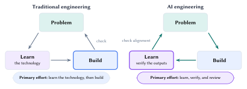
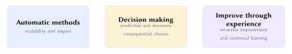
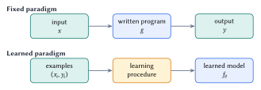
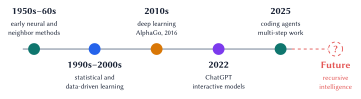
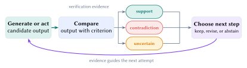
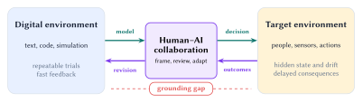

Machine learning uses experience to improve decisions. Improvement depends on evidence about performance, failure, and transfer to the intended environment. This lecture connects building, verification, and real-world use.

[Download lecture notes (PDF)](https://github.com/jinming99/learn-ml-by-building/raw/main/Lecture%20Notes/lecture-01-what-is-machine-learning.pdf){.btn .btn-primary role="button"}

::: {.callout-note}
## Learning goals

By the end of this lecture, you should be able to:

1. Define machine learning and distinguish a learned model from a fixed program.
2. Explain how verification connects building to evidence.
3. Explain why real-world use requires evidence from the target environment.
:::

## Building shifts the work

Traditional engineering often begins by learning the technology: *How does it work?* AI tools can produce a prototype earlier. Engineering effort then shifts toward three review questions:

> *Why should it work? When will it fail? What evidence supports it?*

{#fig-learning-loop fig-alt="Two triangular engineering cycles connect problem, learn, and build. Traditional engineering moves from problem to learning to building; AI engineering moves from problem to building to verification and learning." fig-align="center" width="100%"}

The AI cycle studies the outputs and checks their alignment with the original problem. Review and verification guide the next build.

**Start with the intended use.** Define the task, operating environment, and cost of failure before choosing a model. These choices determine the evidence required. Unit tests measure software behavior under specified cases. Medical and control systems also require evidence from their operating conditions.

People set the goal, identify important failures, collect evidence, and decide whether the evidence supports the intended use.

## Machine learning uses experience

A practical definition has three parts:

{fig-alt="Machine learning combines automatic methods, decision making, and improvement through experience. The three parts connect scalability and impact, prediction and discovery, and continual learning." fig-align="center" width="100%"}

Automation gives machine learning scale and impact. Predictions and discoveries can shape consequential choices. Improvement requires experience and a feedback signal aligned with the goal. Repeated feedback can support continual learning and recursive improvement.

{#fig-programming-vs-learning fig-alt="The fixed paradigm maps an input through a written program to an output. The learned paradigm maps examples through a learning procedure to a learned model." fig-align="center" width="92%"}

@fig-programming-vs-learning uses labeled examples $(x_i,y_i)$. Other systems learn from rewards, comparisons, demonstrations, or unlabeled data. In every setting, identify the experience, the part of the system that changes, and the measure of improvement.

Machine-learning history is cumulative. Early neural and neighbor methods remain useful. Later advances expanded the scale of learning and changed how people interact with learned systems.

{#fig-selective-history fig-alt="A timeline runs from early neural and neighbor methods in the 1950s and 1960s through statistical learning, deep learning, ChatGPT, coding agents, and an open question about recursive intelligence." fig-align="center" width="100%"}

ChatGPT made foundation models widely interactive. Coding agents extend them into multi-step work. Recursive intelligence remains an open question. These systems require clear objectives, review, and evidence.

## Learning needs a verification signal

Generation produces candidates. A verification signal measures behavior, judges improvement, and guides the next attempt.

{#fig-verification-signal fig-alt="A candidate output is compared with a criterion. Evidence can support the claim, contradict it, or remain uncertain. The result guides whether to keep, revise, or abstain." fig-align="center" width="100%"}

Software tests, checked calculations, and game scores provide direct digital feedback. Each check measures a specific criterion.

::: {.table-responsive}
| Setting | Candidate | Possible signal | What remains unresolved |
|:--|:--|:--|:--|
| Software | Program or patch | Tests, static checks, runtime behavior | Whether the tests express the full requirement |
| Mathematics | Answer or proof | Recalculation, proof checking, counterexamples | Whether the assumptions and question are correct |
| Physical system | Decision or policy | Sensors, constraints, outcomes over time | Noise, drift, delayed effects, and rare harm |

: The useful verification signal depends on the task. Every signal leaves some uncertainty outside what it measures. {#tbl-verification-signals}
:::

::: {.callout-warning}
## Match the signal to the intended use

Tests cover tested behavior. Scores encode the chosen objective. Sensors cover what they observe. Choose criteria for the intended use and major failure modes.
:::

Trust grows from repeated evidence for a specific claim under stated conditions. Missing, ambiguous, or out-of-environment evidence weakens the claim.

## Real-world use requires real-world evidence

Digital environments offer repeatable trials and fast feedback. Real-world use adds hidden state, measurement error, changing conditions, people, and irreversible consequences.

{#fig-grounding-gap fig-alt="A digital environment sends a model through human-AI collaboration to a target environment. Outcomes return through collaboration to guide revision, bridging the grounding gap." fig-align="center" width="100%"}

Digital training captures patterns in text, code, simulations, or games. Deployment also depends on physical causes, human behavior, and real consequences. Simulation narrows the gap. Target-environment evidence tests the remaining mismatch.

Human-AI collaboration keeps the transfer claim explicit. AI supports rapid generation and simulation. People define the task, interpret target-environment evidence, and decide what requires revision.

**Diagnose failures through the evidence.** Inspect the problem formulation, training experience, verification signal, and deployment environment before tuning the learning algorithm.

## Lecture summary

Machine learning uses experience to improve decisions. Relevant evidence guides each iteration and tests whether performance transfers to the intended environment.

---

::: {.small}
**Acknowledgment.** These notes are based on the instructor's handwritten notes and transcripts of lecture discussions and were editorially polished and typeset with assistance from OpenAI Codex and Anthropic Claude. The instructor reviewed and is responsible for the final content.
:::

[← Course materials](../lectures/01-overview.qmd) | [Next lecture note: k-Nearest Neighbors →](02-k-nearest-neighbors.html)
