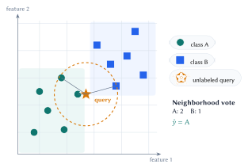
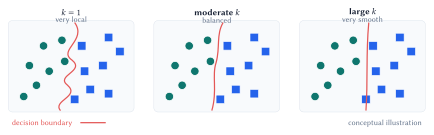
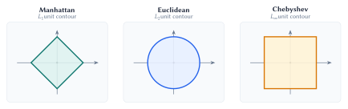
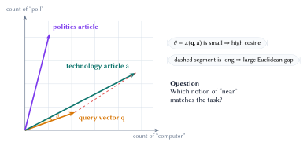
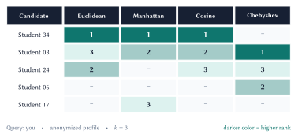
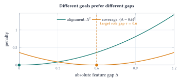
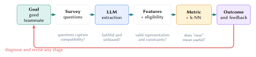

Nearest-neighbor methods begin with a practical problem and a simple assumption: proximity under the chosen representation and distance should support useful predictions. Understanding the model means tracing that assumption through data collection, feature construction, eligibility, geometry, and evaluation.

::: {.lecture-note-actions role="navigation" aria-label="Lecture note navigation"}
[Course materials](../lectures/02-knn.qmd){.btn .btn-primary .btn-sm}
[Previous native note](01-what-is-machine-learning.qmd){.btn .btn-outline-secondary .btn-sm}
:::

::: {.callout-tip}
## Learning goals

By the end of this lecture, you should be able to:

1. start from a practical decision and formulate its examples, features, target, eligibility rules, and evidence of success;
2. apply k-NN classification using a neighborhood, a voting rule, and a justified choice of $k$;
3. explain how the representation and distance encode the model's proximity assumption; and
4. translate a human preference into a logical constraint and a loss for distance learning.
:::

## Begin with the problem

Machine learning starts with a decision we want to improve. The algorithm comes later.

::: {.callout-note}
## Design note

A precise problem statement prevents a common failure: optimizing a clean mathematical target that does not correspond to the real decision.
:::

### A brief labeled example

Begin with the problem: predict whether a listener will like a new track using historical likes and dislikes. Represent each track as a feature vector such as

$$
\mathbf{x}
=
\begin{bmatrix}
\text{tempo} & \text{energy} & \text{danceability} & \text{acousticness} & \cdots
\end{bmatrix}^{\!\top}
\in \mathbb{R}^d,
$$

with an observed label $y\in\{0,1\}$, where $1$ denotes "liked." The data are

$$
\mathcal D=\{(\mathbf{x}_i,y_i)\}_{i=1}^{n}.
$$

For an unseen track $\mathbf{x}_\star$, the output is a prediction $\widehat y(\mathbf{x}_\star)$. The hat matters: $y$ is observed evidence; $\widehat y$ is what the model predicts.

Using k-NN adds a modeling assumption: proximity should support good predictions. Data collection and feature design are part of that assumption because they determine which forms of proximity the model can see.

## The k-nearest-neighbor rule

Let $\mathcal D=\{(\mathbf{x}_i,y_i)\}_{i=1}^{n}$ and let $d(\cdot,\cdot)$ be a dissimilarity rule. For a query $\mathbf{x}$, sort the training indices so that

$$
d(\mathbf{x},\mathbf{x}_{(1)})
\le d(\mathbf{x},\mathbf{x}_{(2)})
\le \cdots
\le d(\mathbf{x},\mathbf{x}_{(n)}).
$$

The neighborhood index set is

$$
\mathcal N_k(\mathbf{x})=\{(1),(2),\ldots,(k)\}.
$$

This order-statistic definition makes the computation transparent. If points tie at the $k$th distance, a deterministic rule is still required.

{#fig-knn-neighborhood fig-alt="A binary scatterplot with a query point and its three nearest neighbors highlighted." width=92%}

### Classification and distance weighting

For class labels $c\in\mathcal C$, unweighted k-NN classification predicts

$$
\widehat y(\mathbf{x})
=
\operatorname*{arg\,max}_{c\in\mathcal C}
\sum_{i\in\mathcal N_k(\mathbf{x})}
\mathbb{1}[y_i=c].
$$

Closer neighbors can receive more influence. With nonnegative weights $a_i(\mathbf{x})$, a common choice is

$$
a_i(\mathbf{x})
=
\frac{1}{d(\mathbf{x},\mathbf{x}_i)+\varepsilon},
\qquad \varepsilon>0.
$$

The weighted classifier replaces vote counts with weighted counts. The small $\varepsilon$ prevents division by zero, although exact matches deserve an explicit policy.

### What does $k$ control?

In classification, $k$ controls how local the vote is. A small $k$ follows individual observations closely; a larger $k$ aggregates evidence across a wider neighborhood.

{#fig-k-behavior fig-alt="Three classification sketches compare increasingly smooth decision boundaries as k grows." width=100%}

::: {.table-responsive}
| Choice | Boundary behavior | Main advantage | Main risk |
|---|---|---|---|
| $k=1$ | Highly local and irregular | Preserves fine structure | Sensitive to noise and mislabeled points |
| Moderate $k$ | Smooths nearby evidence | Often balances bias and variance | Must be tuned to density and sample size |
| Large $k$ | Approaches a global vote | Stable under local noise | Erases local structure and favors common classes |

: The appropriate $k$ is data-dependent. Cross-validation estimates which neighborhood size generalizes. {#tbl-k-tradeoff}
:::

::: {.callout-warning}
## Odd $k$ is not a complete tie policy

An odd $k$ reduces vote ties only for binary classification when the neighborhood itself is unambiguous. Multiclass votes, equal distances at the cutoff, and duplicate points can still tie. Use a documented rule such as distance-weighted voting, a fixed class order, or inclusion of all points tied at the boundary.
:::

## The geometry is the model

The k-NN rule assumes that nearby examples are useful for prediction, but the distance decides which examples count as nearby. Changing the dissimilarity can change every neighbor. In a zero-shot system, this is a substantive modeling assumption.

Let $\Delta_j=x_j-z_j$. The Minkowski family is

$$
d_p(\mathbf{x},\mathbf{z})
=
\left(\sum_{j=1}^{d}|\Delta_j|^p\right)^{1/p},
\qquad p\ge 1.
$$

Euclidean distance uses $p=2$, Manhattan uses $p=1$, and the limit $p\to\infty$ gives Chebyshev distance.

{#fig-distance-geometries fig-alt="Unit contours compare Manhattan, Euclidean, and Chebyshev distance in two dimensions." width=100%}

### Four common rules

::: {.table-responsive}
| Rule | Definition | Useful when | Caution |
|---|---|---|---|
| Euclidean | $\sqrt{\sum_j\Delta_j^2}$ | Straight-line proximity is meaningful; large coordinate gaps should count strongly | Sensitive to outliers and irrelevant coordinates |
| Manhattan | $\sum_j|\Delta_j|$ | Coordinate-wise deviations add; sparse or robust comparisons are desirable | Axes remain equally weighted by default |
| Chebyshev | $\max_j|\Delta_j|$ | The largest mismatch acts like a deal-breaker | Ignores improvement on nonmaximum coordinates until the maximum changes |
| Cosine dissimilarity | $1-\dfrac{\mathbf{x}^{\top}\mathbf{z}}{\lVert\mathbf{x}\rVert_2\lVert\mathbf{z}\rVert_2}$ | Direction or relative pattern matters more than magnitude | Undefined for a zero vector; $1-\cos$ is not generally a mathematical metric |

: Metric choice should follow the semantics of the features and the downstream decision. {#tbl-metrics}
:::

### Why cosine helps with document counts

Suppose articles are represented only by counts of the words "computer" and "poll." A long technology article and a short technology query may point in nearly the same direction even when their Euclidean distance is large. Cosine similarity measures that direction:

$$
\operatorname{cosim}(\mathbf{x},\mathbf{z})
=
\frac{\mathbf{x}^{\top}\mathbf{z}}
{\lVert\mathbf{x}\rVert_2\lVert\mathbf{z}\rVert_2}
=\cos\theta.
$$

Here $\theta$ is the angle directly between the two nonzero vectors at their shared origin.

{#fig-cosine-vectors fig-alt="A short query vector and a longer technology-article vector share an origin, with theta marking the small angle between them." width=100%}

::: {.callout-warning}
## Validity requires a domain argument

A metric can be mathematically well-defined and still encode the wrong domain assumption. A useful task-specific score may also violate symmetry or the triangle inequality. Name the object honestly: *distance*, *dissimilarity*, or *compatibility cost*.
:::

## Case study: zero-shot teammate matching

The lecture dataset contains 41 survey responses. An NLP extraction step maps each response to eight numerical axes on a nominal $[-1,1]$ range. Treat yourself as the fixed query. The missing outcome for each candidate is

$$
y_i=\mathbb{1}\{\text{student $i$ works well with me}\}.
$$

Those collaboration outcomes do not yet exist. The first system is nearest-neighbor candidate ranking under designed assumptions.

::: {.callout-note}
## Role of k-NN

k-NN returns the nearest eligible candidates under the representation and scoring rule we choose. The system designer still has to define compatibility.
:::

### Representation and system roles

::: {.table-responsive}
| Feature | Negative endpoint | Positive endpoint | Possible role |
|---|---|---|---|
| `theory_implementation` | Theory / mathematics | Implementation / engineering | Role coverage |
| `research_industry` | Research / academic | Industry / product | Context dependent |
| `structured_exploratory` | Structured problems | Exploratory / open-ended | Work-style alignment |
| `solo_collaborative` | Solo work | Team collaboration | Work-style alignment |
| `depth_breadth` | Deep focus | Broad interests | Context dependent |
| `plan_iterate` | Plan first | Iterate quickly | Work-style alignment |
| `data_model` | Data / analysis first | Model / algorithm first | Role coverage |
| `foundational_applied` | Build foundations | Applied solutions | Context dependent |

: The eight extracted axes. The final column is a design hypothesis, not a discovered fact. {#tbl-eight-features}
:::

The categorical `team_status` field serves a different purpose: it is an eligibility rule. Students choosing to work solo should be filtered out before distances are ranked. Treating eligibility as another coordinate can return operationally invalid neighbors.

::: {.callout-note}
## Separate the layers

Representation features, eligibility constraints, and the scoring function answer different questions. Keep them explicit.
:::

### Standard metrics disagree

For the worked comparison, one anonymized profile stands in for you. The notebook ranks all eligible candidates using all eight features and keeps the top three under each rule.

{#fig-rank-matrix fig-alt="A matrix compares the top three teammate candidates under Euclidean, Manhattan, cosine, and Chebyshev scoring." width=92%}

The disagreement is not an implementation bug. Euclidean aggregates squared gaps, Manhattan aggregates absolute gaps, cosine compares orientation, and Chebyshev focuses on the largest coordinate gap. Each rule compresses the same profile difference differently.

::: {.callout-warning}
## What unlabeled data cannot tell us

Without compatibility outcomes, @fig-rank-matrix cannot identify a correct metric. The metric must be defended as a transparent domain assumption and later validated against feedback or collaboration outcomes.
:::

### Similarity is only one design objective

A team matcher may seek:

- **alignment** on working approach, to reduce coordination friction;
- **coverage** across technical perspectives, to avoid redundant strengths; and
- **eligibility** constraints, to respect availability and stated preferences.

These objectives are not equivalent to Euclidean closeness. We can alter the geometry by learning which similarities matter from feedback or by targeting nonzero gaps for complementary roles.

## Learning and designing a better ruler

Distance learning begins with a concrete failure: we prefer $A$ to $B$, but the current metric ranks $B$ closer. We turn that desired ordering into a logical condition and then a loss the machine can optimize.

### A two-feature counterexample

Consider a toy $[0,10]$ profile with

$$
\mathbf{x}_{\mathrm{me}}=[5,5],
\qquad
\mathbf{x}_A=[5,9],
\qquad
\mathbf{x}_B=[7,6].
$$

The first feature is theory versus implementation; the second is coding versus mathematics. Suppose prior experience says $A$ is preferred to $B$.

::: {.table-responsive}
| Candidate | Squared gap on $x_1$ | Squared gap on $x_2$ | Unweighted squared distance |
|---|---:|---:|---:|
| $A=[5,9]$ | $(5-5)^2=0$ | $(5-9)^2=16$ | $16$ |
| $B=[7,6]$ | $(5-7)^2=4$ | $(5-6)^2=1$ | $5$ |

: Ordinary Euclidean distance ranks $B$ closer even though the observed preference favors $A$. {#tbl-unweighted-example}
:::

The human preference becomes the logical condition

$$
d_{\mathbf{w}}(\mathbf{x}_{\mathrm{me}},\mathbf{x}_A)^2
<
d_{\mathbf{w}}(\mathbf{x}_{\mathrm{me}},\mathbf{x}_B)^2.
$$

Give the model parameters that can satisfy this ordering with a diagonal weighted squared distance:

$$
d_{\mathbf{w}}(\mathbf{x},\mathbf{z})^2
=
\sum_{j=1}^{d}w_j(x_j-z_j)^2,
\qquad w_j\ge 0.
$$

If every weight is strictly positive, $d_{\mathbf{w}}$ is a metric. Allowing a zero weight collapses that coordinate and yields a pseudometric.

With $w_1=4$ and $w_2=1$, the squared distances become $16$ for $A$ and $17$ for $B$. The ranking flips because agreement on the first feature is declared four times as important.

::: {.callout-warning}
## What diagonal weights can express

Positive diagonal weights learn which similarities matter. They cannot reward a nonzero feature gap, model interactions between features, or satisfy a preference when the positive example is no closer on any available coordinate.
:::

### From a preference to a learnable loss

A triplet $(a,p,n)$ records that anchor $a$ prefers positive example $p$ over negative example $n$. With margin $m>0$, the desired condition is

$$
d_{\mathbf{w}}(a,p)^2+m
\le
d_{\mathbf{w}}(a,n)^2.
$$

Define the constraint gap

$$
g_{a,p,n}(\mathbf{w})
=
d_{\mathbf{w}}(a,n)^2-d_{\mathbf{w}}(a,p)^2.
$$

The condition is $g_{a,p,n}(\mathbf{w})\ge m$. The hinge loss measures how far the current weights are from satisfying it:

$$
\mathcal L(\mathbf{w})
=
\max\bigl(0,m-g_{a,p,n}(\mathbf{w})\bigr).
$$

**Why the maximum matters.** Without the outer maximum, minimizing $m-g$ would keep rewarding an already-correct triplet for making the gap arbitrarily large. Clipping at zero once the margin is met prevents this reward hacking and focuses learning on preferences that are still violated.

For an active hinge, the feature-wise gradient is

$$
\frac{\partial\mathcal L}{\partial w_j}
=
(a_j-p_j)^2-(a_j-n_j)^2.
$$

A projected update keeps weights feasible:

$$
\mathbf{w}
\leftarrow
\Pi_{\mathbb{R}_{\ge 0}^{d}}
\left(\mathbf{w}-\eta\nabla_{\mathbf{w}}\mathcal L\right).
$$

These updates require observed preference triplets. Learned weights should be assessed on held-out feedback; satisfying the training triplets alone does not establish useful compatibility.

### Complementarity requires a different objective

A maximum-gap rule can reward extreme differences even when extremes make collaboration harder. A more explicit design targets a moderate gap for role coverage.

For absolute feature gaps $\Delta_j=|x_j-z_j|$, split features into alignment set $S$ and coverage set $C$:

$$
\begin{aligned}
L_{\mathrm{align}}
&=\operatorname{mean}_{j\in S}\Delta_j^2,\\
L_{\mathrm{cover}}
&=\operatorname{mean}_{j\in C}(\Delta_j-\tau)^2,\\
C(\mathbf{x},\mathbf{z})
&=\alpha L_{\mathrm{align}}
+(1-\alpha)L_{\mathrm{cover}}.
\end{aligned}
$$

In the worked example, the alignment set contains *structured/exploratory*; the coverage set contains *theory/implementation* and *data/model*. We use $\tau=0.6$ and $\alpha=0.5$.

{#fig-compatibility-penalties fig-alt="Two penalty curves show alignment minimized at zero gap and role coverage minimized at a target gap of 0.6." width=96%}

::: {.callout-important}
## Compatibility cost

On a coverage feature, zero gap can receive a penalty, so identity of indiscernibles fails. The score ranks potential partners for one query; it does not prove compatibility or optimize an entire team's composition.
:::

## Evaluation belongs to the whole pipeline

An apparently simple neighbor lookup rests on a chain of assumptions: the problem is framed correctly, data collection captures relevant evidence, the representation preserves it, eligibility is valid, and the chosen distance makes proximity useful. When outcomes are poor, diagnose the whole chain. The choice of $k$ is only one possible source.

{#fig-system-pipeline fig-alt="A pipeline connects problem framing, survey questions, feature extraction, eligibility, distance, ranking, and outcome evaluation." width=100%}

### Match evaluation to the task

::: {.table-responsive}
| Setting | Validation unit | Useful measurements | Leakage to avoid |
|---|---|---|---|
| Supervised classification | Future examples or entities, depending on deployment | Accuracy, balanced accuracy, precision/recall, calibration | The same entity or a near duplicate in train and test |
| Candidate ranking | Query with judged relevant items | Recall@$k$, precision@$k$, mean reciprocal rank, NDCG | Using relevance feedback from evaluation queries to design the metric |
| Team matching | Pair or team outcome after collaboration | Preference satisfaction, acceptance rate, project outcome, subgroup diagnostics | Using evaluation preferences to design or fit the score |

: Choose a split and measurement that reproduce the future decision. {#tbl-evaluation}
:::

For supervised k-NN, tune preprocessing, the distance rule, weighting, and $k$ inside cross-validation. For teammate ranking, compare transparent baselines and gather outcome feedback before presenting rankings as learned recommendations.

::: {.callout-tip}
## Baseline ladder

Start with a simple eligible-candidate baseline, then compare unweighted Euclidean, alternative metrics, weighted k-NN, and only then a custom learned or complementary score. Each extra degree of freedom should earn its complexity on held-out evidence.
:::

### Diagnose failures at the right layer

::: {.table-responsive}
| Layer | Assumption | Diagnostic | Possible intervention |
|---|---|---|---|
| Goal | "Good teammate" has an operational meaning | Compare stakeholder definitions and downstream outcomes | Reframe the target; separate compatibility, coverage, and logistics |
| Survey | Questions capture relevant, answerable traits | Reliability checks; missingness; interviews; outcome correlations | Revise questions or collect direct behavioral evidence |
| Extraction | Text becomes faithful numerical features | Human rubric audit; repeated extraction; subgroup error analysis | Calibrate prompts or rubrics, add examples, or replace the extractor |
| Eligibility | Returned candidates are actionable | Count invalid recommendations and constraint violations | Filter first; encode hard constraints outside the distance |
| Geometry | Lower score corresponds to better pairs | Neighbor inspection; counterexamples; held-out preferences | Reweight, learn a metric, or redesign the score |
| Outcome | The ranking improves collaboration | Prospective evaluation and qualitative follow-up | Revisit upstream layers; retuning $k$ alone may not help |

: A failure map for the full pipeline. Model tuning is only one possible response. {#tbl-failure-layers}
:::

---

**Lecture summary.** Practical k-NN starts from the problem: trace the assumption that proximity predicts well through data collection, representation, eligibility, distance, and evaluation, then convert observed ranking failures into constraints and losses the model can learn from.

## Further reading

- T. Cover and P. Hart, ["Nearest Neighbor Pattern Classification"](https://doi.org/10.1109/TIT.1967.1053964), 1967.
- [scikit-learn: Nearest Neighbors User Guide](https://scikit-learn.org/stable/modules/neighbors.html).
- Course notebook: [`02-KNN.ipynb`](https://github.com/jinming99/learn-ml-by-building/blob/main/Lecture%202%20KNN/02-KNN.ipynb).

::: {.small .text-muted}
**Acknowledgment.** These notes are based on the instructor's handwritten notes and transcripts of lecture discussions and were editorially polished and typeset with assistance from OpenAI Codex and Anthropic Claude. The instructor reviewed and is responsible for the final content.
:::

---

[Previous native note: What Is Machine Learning?](01-what-is-machine-learning.qmd) · [Lecture 2 course materials](../lectures/02-knn.qmd)
