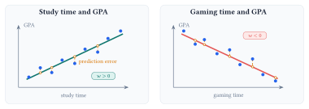
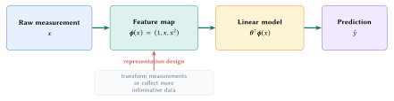

Linear regression predicts a number from input features. The model defines how features produce predictions, the loss defines a good fit, and the feature representation determines which relationships the model can express.

::: {.lecture-note-actions role="navigation" aria-label="Lecture note navigation"}
[Course materials](../lectures/03-linear.qmd){.btn .btn-primary .btn-sm}
[Previous lecture](02-k-nearest-neighbors.qmd){.btn .btn-outline-secondary .btn-sm}
[Next lecture](04-gradient-descent-and-optimization.qmd){.btn .btn-outline-secondary .btn-sm}
:::

::: {.callout-note}
## Learning goals

By the end of this lecture, you should be able to:

1. identify a regression problem and interpret the weight and bias in a linear model;
2. explain why signed error is unsuitable as a loss and compute mean squared error; and
3. explain how a feature map lets a linear model represent a curved relationship.
:::

## Begin with the prediction problem

Consider predicting a student's GPA from a feature such as study time. A scatterplot might show GPA increasing with study time or decreasing with gaming time. Linear regression represents either trend with a line.

::: {.callout-note}
## Classification and regression

Classification predicts a category, such as whether an image contains a cat. Regression predicts a number, such as a student's GPA. The output type determines the task. Here the target is numerical, so this is a regression problem.
:::

{#fig-linear-relationships fig-alt="Two synthetic scatterplots show GPA increasing with study time and decreasing with gaming time. Gold vertical segments connect observed data points to their predictions on the fitted lines." fig-align="center" width="100%"}

For observations $\mathcal D=\{(x_i,y_i)\}_{i=1}^{n}$, the one-feature model predicts

$$
\widehat y_i = w x_i+b.
$$

The input $x_i$ is a *feature*, $y_i$ is the observed *target*, and $\widehat y_i$ is the model's prediction. The two learned coefficients play different roles.

::: {.table-responsive}
| Quantity | Role | Effect on the prediction |
|:--|:--|:--|
| $w$ | Weight or slope | Changes how much $\widehat y$ moves when $x$ increases by one unit. |
| $b$ | Bias or intercept | Shifts every prediction by the same amount. |
| $\widehat y_i$ | Predicted target | Gives the model's estimate for example $i$. |

: The components of a one-feature linear model. {#tbl-linear-terms}
:::

With several features, the model becomes $\widehat y_i=\mathbf w^{\top}\mathbf x_i+b$. It assumes that the chosen features contain useful information about the target and that the same coefficients apply across examples. Training chooses the coefficients that make the predictions close to the observed targets.

## Define what counts as error

A model needs a numerical definition of a good prediction. For example $i$, define the residual as

$$
e_i=y_i-\widehat y_i.
$$

::: {.callout-warning}
## Why signed error fails

A common first reaction is to use the signed difference $\ell_i=y_i-\widehat y_i$ as the loss. When these signed errors are averaged over the dataset, positive and negative values can cancel. More importantly, minimizing this loss rewards arbitrarily large predictions: increasing $\widehat y_i$ drives $\ell_i$ toward $-\infty$ even as the prediction gets worse. This is a simple form of reward hacking: the model improves the score without improving the prediction. Absolute and squared loss close the loophole by assigning every error a nonnegative penalty.
:::

Two common ways to turn a residual into a per-example loss $\ell(y_i,\widehat y_i)$ are:

::: {.table-responsive}
| Loss | Definition | Behavior |
|:--|:--|:--|
| Absolute loss | $|y_i-\widehat y_i|$ | The penalty grows in direct proportion to the size of the error. |
| Squared loss | $(y_i-\widehat y_i)^2$ | The penalty grows quadratically, so larger errors receive more weight. |

: Two ways to score the error on one example. This lecture uses squared loss. {#tbl-point-losses}
:::

For squared loss, the training loss is the average squared error across the dataset:

$$
L(w,b)
=\frac{1}{n}\sum_{i=1}^{n}\bigl(y_i-\widehat y_i\bigr)^2
=\frac{1}{n}\sum_{i=1}^{n}\bigl(y_i-(wx_i+b)\bigr)^2.
$$

This quantity is the *mean squared error* (MSE).

::: {.table-responsive}
| Example | Target $y_i$ | Prediction $\widehat y_i$ | Squared error |
|:--|:--|:--|:--|
| 1 | 7 | 10 | $(7-10)^2=9$ |
| 2 | 5 | 5 | $(5-5)^2=0$ |
| 3 | 7 | 5 | $(7-5)^2=4$ |

: A three-example calculation gives $\operatorname{MSE}=(9+0+4)/3=13/3$. {#tbl-mse-example}
:::

A lower MSE means that the squared errors are smaller on average for this dataset.

## Representation sets what the model can express

To model a curved relationship, we can transform the original input $x$ into polynomial features before fitting the model. For degree $d$, define

$$
\boldsymbol\phi(x)=
\begin{bmatrix}
1 & x & x^2 & \cdots & x^d
\end{bmatrix}^{\!\top},
\qquad
\widehat y=\boldsymbol\theta^{\top}\boldsymbol\phi(x).
$$

The prediction can now curve with $x$. The parameters still enter linearly: in $\theta_0+\theta_1x+\theta_2x^2$, each learned coefficient appears only to the first power.

{#fig-feature-pipeline fig-alt="A pipeline maps a raw measurement through a feature map and a linear model to a prediction. A separate annotation shows that measurements can be transformed or improved before fitting." fig-align="center" width="100%"}

Residuals can show when the current features are inadequate. A systematic curve in the residuals means that the current features leave predictable structure unexplained. Adjusting the coefficients alone cannot fit a pattern the representation cannot express. Change the feature map or collect better measurements.

---

**Lecture summary.** Linear regression predicts a number from a weighted combination of features. The loss defines a good fit, and the feature representation determines which relationships the model can learn.

::: {.small .text-muted}
**Acknowledgment.** These notes are based on the instructor's handwritten notes and transcripts of lecture discussions and were editorially polished and typeset with assistance from OpenAI Codex and Anthropic Claude. The instructor reviewed and is responsible for the final content.
:::

---

[Previous lecture: k-Nearest Neighbors](02-k-nearest-neighbors.qmd) · [Next lecture: Gradient Descent and Optimization](04-gradient-descent-and-optimization.qmd) · [Lecture 3 course materials](../lectures/03-linear.qmd)
