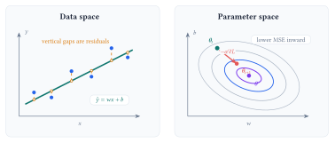
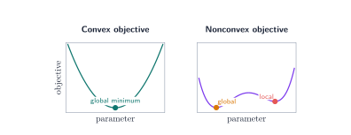
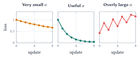

Training searches for parameter values that reduce a loss. Optimization methods differ in the information they use: function values, gradients, or curvature.

::: {.lecture-note-actions role="navigation" aria-label="Lecture note navigation"}
[Course materials](../lectures/04-optimization.qmd){.btn .btn-primary .btn-sm}
[Previous lecture](03-linear-regression.qmd){.btn .btn-outline-secondary .btn-sm}
:::

::: {.callout-note}
## Learning goals

By the end of this lecture, you should be able to:

1. formulate a learning task using variables, an objective, and constraints;
2. distinguish local and global minima and explain convexity;
3. derive gradient descent and explain the roles of the learning rate and data per update; and
4. compare zeroth-, first-, and second-order methods by information, use, and scale.
:::

## Start from the training problem

Lecture 3 specified a linear predictor and its mean squared error:

$$
\widehat y_i=wx_i+b,
\qquad
L(w,b)=\frac{1}{n}\sum_{i=1}^{n}\bigl(y_i-(wx_i+b)\bigr)^2.
$$

Training finds values of $w$ and $b$ that make this objective small. Trying a few values by hand can build intuition. A learning procedure needs a systematic way to update them.

The model defines the predictions available for a given input. The loss scores how well those predictions match the data. Optimization searches for parameter values that reduce that score.

{#fig-fit-and-loss fig-alt="A current regression fit and gold residuals appear beside an MSE contour map. Matching teal marks identify the current fitted line and parameter point, and a coral arrow shows one update toward the purple optimum." fig-align="center" width="100%"}

## Specify the optimization problem

In general, an optimization problem takes the form

$$
\boldsymbol\theta^{\star}\in
\operatorname*{arg\,min}_{\boldsymbol\theta}\; f(\boldsymbol\theta)
\qquad
\text{subject to}\qquad
g_j(\boldsymbol\theta)\le 0,
\quad j=1,\ldots,m.
$$

For one-feature linear regression, $\boldsymbol\theta=(w,b)^{\top}$ and the objective $f$ is the MSE above. Many introductory problems have no explicit constraints.

::: {.table-responsive}
| Part | Linear regression | Question it answers |
|:--|:--|:--|
| Variables | $\boldsymbol\theta=(w,b)^{\top}$ | Which values may the optimizer change? |
| Objective | $L(w,b)$ | How does the system score a candidate model? |
| Constraints | Feasible values of $\boldsymbol\theta$ | Which candidate models are allowed? |

: An optimization problem is defined by its variables, objective, and any constraints. {#tbl-optimization-parts}
:::

Specifying an optimization problem creates a contract with the ML model: the variables define what may change, the constraints define what is allowed, and the loss or reward defines what counts as success. This parallels contract design in economics, where incentives are chosen to shape an agent's behavior when every action cannot be prescribed directly. Designing losses and rewards remains an active area of research because a learned system follows the objective we provide, including any gaps between that objective and the outcome we intended.

The shape of the objective determines what a search method can guarantee. A *global minimum* has the lowest objective value over the full feasible set. At a *local minimum*, no nearby point has a lower value.

{#fig-loss-landscapes fig-alt="Two conceptual loss landscapes compare a convex bowl with a nonconvex curve containing a global minimum and a higher local minimum." fig-align="center" width="100%"}

## Gradient descent turns loss into updates

For the model and loss above, differentiating the MSE gives

$$
\begin{aligned}
\frac{\partial L}{\partial w}
&=-\frac{2}{n}\sum_{i=1}^{n}x_i\bigl(y_i-\widehat y_i\bigr),\\
\frac{\partial L}{\partial b}
&=-\frac{2}{n}\sum_{i=1}^{n}\bigl(y_i-\widehat y_i\bigr).
\end{aligned}
$$

Near the current parameters, the gradient $\nabla L(\boldsymbol\theta)$ points in the direction in which the loss increases fastest. Gradient descent takes a step in the opposite direction:

$$
\boldsymbol\theta_{t+1}
=\boldsymbol\theta_t-\alpha\nabla L(\boldsymbol\theta_t),
$$

where $\alpha>0$ is the learning rate. It controls how far the parameters move at each update.

{#fig-learning-rate fig-alt="Three conceptual loss curves compare learning rates that are very small, useful, and overly large." fig-align="center" width="100%"}

The same update can use different amounts of data to estimate the gradient:

::: {.table-responsive}
| Method | Examples per update | Practical behavior |
|:--|:--|:--|
| Batch gradient descent | All $n$ examples | Exact gradient of the empirical loss; each update can be expensive. |
| Stochastic gradient descent | One sampled example | Inexpensive, frequent, and noisy updates. |
| Mini-batch gradient descent | A small sampled group | Balances computation with a less noisy gradient estimate; common in practice. |

: Examples per update change the computation and variability of the gradient estimate. {#tbl-batch-choices}
:::

When examples are sampled appropriately, all three methods target the same training objective. They differ in the cost and variability of each update. A fair comparison should track both passes through the data and the total number of parameter updates.

## Optimization methods by order

The *order* of an optimization method describes the derivative information available to it. Additional information can improve the search direction; it also raises the cost of computation and storage.

::: {.table-responsive}
| Order | Information used | Representative methods | Applications and tradeoff |
|:--|:--|:--|:--|
| Zeroth | Values of $f(\boldsymbol\theta)$ | Finite differences, random directions, SPSA | Simulators, physical experiments, and black-box systems; function queries and dimension can make estimates costly or noisy. |
| First | Gradients or stochastic gradients | GD, SGD, momentum, Nesterov acceleration, AdaGrad, Adam | Large datasets and high-dimensional models; inexpensive vector updates often require many iterations. |
| Second | Gradients and curvature | Newton, Gauss-Newton, Levenberg-Marquardt | Smooth, moderate-size problems; strong directions and fast local convergence come with expensive curvature calculations. |

: The useful method depends on which information can be obtained at a reasonable cost. {#tbl-method-orders}
:::

Zeroth-order methods observe only objective values, which makes them useful for black-box systems, simulators, and experiments where gradients are unavailable. A random-direction method can use one sampled perturbation to estimate first-order information in expectation for a smoothed objective, though individual estimates can be noisy. First-order methods use gradients and include SGD, momentum, Nesterov acceleration, adaptive methods such as AdaGrad and Adam, and proximal methods. Their modest cost per update makes them the standard choice for large-scale ML. Second-order methods such as Newton's method also use curvature and can converge in far fewer iterations near a solution. Computing and storing curvature may be too expensive for large datasets and models, so quasi-Newton and Hessian-free methods provide practical compromises.

---

**Lecture summary.** An optimization problem specifies the parameters, objective, and constraints; function values, gradients, and curvature determine which algorithms are practical and how per-step cost trades against convergence speed.

::: {.small .text-muted}
**Acknowledgment.** These notes are based on the instructor's handwritten notes and transcripts of lecture discussions and were editorially polished and typeset with assistance from OpenAI Codex and Anthropic Claude. The instructor reviewed and is responsible for the final content.
:::

---

[Previous lecture: Linear Regression](03-linear-regression.qmd) · [Lecture 4 course materials](../lectures/04-optimization.qmd)
