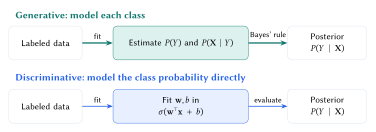
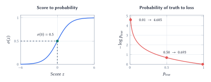
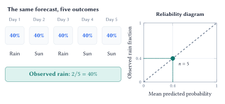

A classifier turns evidence into class probabilities. Its assumptions, probability estimates, and decision rule each need to be evaluated.

::: {.lecture-note-actions role="navigation" aria-label="Lecture note navigation"}
[Course materials](../lectures/05-probclass.qmd){.btn .btn-primary .btn-sm}
[Previous lecture](04-gradient-descent-and-optimization.qmd){.btn .btn-outline-secondary .btn-sm}
:::

::: {.callout-note}
## Learning goals

By the end of this lecture, you should be able to:

1. use Bayes’ rule and distinguish generative from discriminative classification;
2. explain the sigmoid and cross-entropy in logistic regression; and
3. interpret confusion matrices, decision thresholds, and probability calibration.
:::

## From observations to class probabilities

A mushroom classifier uses attributes such as odor, cap color, and habitat to estimate whether a record belongs to the poisonous class. Let $Y=1$ mean poisonous, $Y=0$ mean edible, and $\boldsymbol X$ denote the observed features. The quantity we want is $P(Y=1\mid\boldsymbol X=\boldsymbol x)$. The two errors have different consequences: discarding an edible mushroom and accepting a poisonous one.

**Bayes' rule** relates the desired class probability to the distribution of observations within each class. Suppressing $\boldsymbol X=\boldsymbol x$ for readability,

$$
P(Y=c\mid\boldsymbol x)
=\frac{P(\boldsymbol x\mid Y=c)\,P(Y=c)}{P(\boldsymbol x)}.
$$

The *prior* $P(Y=c)$ describes the class before seeing these features; the *likelihood* $P(\boldsymbol x\mid Y=c)$ describes the features within that class. The *posterior* $P(Y=c\mid\boldsymbol x)$ updates the class probability after observing them. The *evidence* $P(\boldsymbol x)$ normalizes the posteriors so they sum to one over classes.

For the most probable class,

$$
\begin{aligned}
\widehat y
&=\operatorname*{arg\,max}_{c\in\{0,1\}} P(Y=c\mid\boldsymbol x)\\
&=\operatorname*{arg\,max}_{c\in\{0,1\}} P(\boldsymbol x\mid Y=c)P(Y=c).
\end{aligned}
$$

The evidence is shared across classes, so it can be dropped for comparison, but is needed to normalize probabilities. Here $\operatorname*{arg\,max}$ returns the class; $\max$ returns its probability. Choosing the most probable class treats the two errors as equally costly.

## Two ways to learn a classifier

**Generative learning** estimates the class prior $P(Y)$ and the feature distribution $P(\boldsymbol X\mid Y)$ for each class. Together they specify $P(\boldsymbol X,Y)$, which Bayes' rule converts to a posterior. Fitting these distributions is the learning, or estimation, step.

**Discriminative learning** learns a relation from features to classes directly. Logistic regression models $P(Y\mid\boldsymbol X)$ without fitting a separate feature distribution for each class. Support vector machines are also discriminative, but need not directly produce probabilities.

<figure class="lecture-05-figure" id="fig-two-routes">
<picture>
<source media="(max-width: 600px)" srcset="../assets/lecture-notes/lecture-05/two-routes-mobile.svg">

</picture>
<figcaption>Figure 1. Generative and discriminative learning reach class probabilities through different modeling choices. Both still need a decision rule.</figcaption>
</figure>

**Naive Bayes** makes the generative approach manageable by assuming that features are *conditionally independent given the class*:

$$
\begin{aligned}
P(\boldsymbol x\mid Y=c)&=\prod_{j=1}^{d}P(x_j\mid Y=c),\\
P(Y=c\mid\boldsymbol x)&\propto P(Y=c)\prod_{j=1}^{d}P(x_j\mid Y=c).
\end{aligned}
$$

Categorical Naive Bayes estimates these terms from category counts within each class. Smoothing adds a small amount to the counts so an unseen feature-class combination does not force the whole product to zero. The current notebook uses additive smoothing with $\alpha=1$.

The assumption concerns dependence *within* a class. Even after learning that a mushroom is poisonous, knowing one feature may still help predict another. Multiplying likelihoods as though such clues were independent can count related evidence repeatedly and push probabilities toward extremes. Useful class predictions can therefore coexist with poor probability estimates.

::: {.callout-note appearance="simple"}

**Reversing a conditional with the mushroom data.**
The full dataset contains 3,916 poisonous and 4,208 edible records. Of these, 1,008 poisonous and 136 edible records have habitat recorded as “paths.” Thus

$$
\begin{aligned}
&P(\text{poisonous}\mid\text{paths})\\
&=\frac{(1008/3916)(3916/8124)}{1144/8124}\\
&=\frac{1008}{1144}\approx 88.1\%.
\end{aligned}
$$

This differs from

$$
\begin{aligned}
&P(\text{paths}\mid\text{poisonous})\\
&=1008/3916\approx25.7\%.
\end{aligned}
$$

These are descriptive frequencies in this dataset, not estimates of risk for a mushroom found outdoors.

:::

The 8,124 hypothetical records have 22 categorical attributes and 2,480 unknown stalk-root entries, retained as a category. Logistic regression uses one-hot indicators to avoid inventing an order among colors or habitats; Naive Bayes uses category IDs to index frequency tables.

## Logistic regression and cross-entropy

An ordinary linear predictor can produce values below zero or above one. Logistic regression retains the linear score $z=\boldsymbol w^{\top}\boldsymbol x+b$ and passes it through the *sigmoid*:

$$
\begin{aligned}
\widehat p&=P(Y=1\mid\boldsymbol x;\boldsymbol w,b)\\
&=\sigma(z)=\frac{1}{1+e^{-z}}.
\end{aligned}
$$

For finite $z$, the output lies strictly between zero and one. At $z=0$, it is $0.5$; as $z$ becomes very positive or very negative, it approaches one or zero. A valid output range alone does not establish that the probabilities are accurate.

::: {.lecture-05-aside}
**Slope and bias.**

In one dimension, $|w|$ controls steepness and the $0.5$ boundary is $x=-b/w$ for $w\ne0$. Increasing $b$ raises the poisonous probability at each input; for $w>0$, the curve shifts left.
:::

The model assumes that the log-odds are linear in the chosen features:

$$
\log\frac{\widehat p}{1-\widehat p}=\boldsymbol w^{\top}\boldsymbol x+b.
$$

At threshold $0.5$, the decision boundary is $\boldsymbol w^{\top}\boldsymbol x+b=0$. Feature interactions must be represented explicitly if they are needed.

<figure class="lecture-05-figure" id="fig-sigmoid-loss">
<picture>
<source media="(max-width: 600px)" srcset="../assets/lecture-notes/lecture-05/sigmoid-and-loss-mobile.svg">

</picture>
<figcaption>Figure 2. The sigmoid maps a score to a probability. Cross-entropy scores the probability assigned to the observed class: a confident mistake receives a large loss. These curves show the functions, not fitted mushroom data.</figcaption>
</figure>

For an observed label $y\in\{0,1\}$ and predicted poisonous probability $\widehat p$, **binary cross-entropy** is

$$
\ell(y,\widehat p)
=-y\log\widehat p-(1-y)\log(1-\widehat p).
$$

When $y=1$, only $-\log\widehat p$ remains; when $y=0$, only $-\log(1-\widehat p)$ remains. Equivalently, $\ell=-\log p_{\mathrm{true}}$, where $p_{\mathrm{true}}$ is the probability assigned to the observed class. The label $y$ selects the term; it is not the model's predicted class.

If a poisonous record receives $\widehat p=0.99$, its loss is about $0.010$. If it receives $\widehat p=0.01$, its loss is about $4.605$. The penalty grows logarithmically without bound as the assigned probability of the truth approaches zero. Ordinary cross-entropy treats both classes symmetrically; it does not by itself encode the greater cost of missing poison.

Training minimizes the mean loss over observations. For one record, $\partial\ell/\partial z=\widehat p-y$, which gives the weight gradient $(\widehat p-y)\boldsymbol x$ and bias gradient $\widehat p-y$. Averaging these gradients supplies the updates from Lecture 4.

## Count the errors that the decision creates

A probability becomes a binary prediction through a threshold $t$:

$$
\widehat y=\begin{cases}
1 & \text{if }\widehat p\ge t,\\
0 & \text{if }\widehat p<t.
\end{cases}
$$

Throughout these notes, the positive class is poisonous. A confusion matrix records what happened after applying the threshold.

::: {.table-responsive}
| Actual class | Predicted edible ($0$) | Predicted poisonous ($1$) |
|:--|:--|:--|
| Edible ($0$) | True negative (TN): retained correctly | False positive (FP): edible record rejected |
| Poisonous ($1$) | False negative (FN): poisonous record accepted | True positive (TP): rejected correctly |

: Rows are actual classes; columns are predictions. A false negative is the dangerous direction of error in the mushroom example. {#tbl-confusion}
:::

Accuracy, $(TP+TN)/n$, combines correct decisions and hides the distinction between the two mistakes. The false-negative rate is $FN/(TP+FN)$: among all poisonous records, how many were missed? The fraction poisonous *among records predicted edible* is instead $FN/(TN+FN)$. The denominators answer different questions.

::: {.table-responsive}
| Notebook model | Accuracy | False negatives | False positives |
|:--|:--|:--|:--|
| Logistic regression | 99.9% | 1 | 0 |
| Naive Bayes | 94.6% | 81 | 7 |

: Saved results in the current notebook: 1,625 test records, a stratified 80/20 split with random seed 42, and threshold $t=0.5$. The models use the category encodings described earlier. {#tbl-results}
:::

Lowering $t$ flags more records as poisonous. For fixed predictions and test data, false negatives cannot increase, while false positives cannot decrease. The change may leave counts unchanged if no scores lie between the thresholds. Threshold selection therefore reflects the relative consequences of the two mistakes.

If correct decisions have zero cost, let $C_{\mathrm{FN}}$ be the cost of accepting poison and $C_{\mathrm{FP}}$ the cost of rejecting an edible record. With a trustworthy probability $p$, the expected costs are $C_{\mathrm{FN}}p$ for accepting and $C_{\mathrm{FP}}(1-p)$ for rejecting. Reject when the latter is smaller, giving the cost-based threshold

$$
t^{\star}=\frac{C_{\mathrm{FP}}}{C_{\mathrm{FP}}+C_{\mathrm{FN}}}.
$$

A larger false-negative cost leads to a lower threshold. This calculation assumes the probabilities and costs describe the setting where the decision will be used.

## Check probability calibration

Suppose a weather model predicts a 40% chance of rain on each of five days. The outcomes are rain, sun, rain, sun, sun. Rain occurred on two of five days, so the observed frequency is $2/5=40\%$.

<figure class="lecture-05-figure" id="fig-calibration">
<picture>
<source media="(max-width: 600px)" srcset="../assets/lecture-notes/lecture-05/calibration-mobile.svg">

</picture>
<figcaption>Figure 3. The five-day group lies on the diagonal because its 40% forecast matches the observed rain frequency. Five observations illustrate the idea; they do not establish calibration in general.</figcaption>
</figure>

::: {.lecture-05-aside .lecture-05-calibration-aside}
**What the curve leaves out.**

Inspect bin counts. Most current logistic-regression predictions are near zero or one, leaving little evidence about intermediate probabilities. Extreme probabilities alone do not demonstrate overconfidence.

Calibration also differs from separation: assigning every record the overall poisonous fraction can be calibrated on that population while separating no individuals.
:::

A single dry day does not refute a 40% rain forecast. **Calibration** means that, among cases assigned probability near $p$, the positive outcome occurs about a fraction $p$ of the time:

$$
P(Y=1\mid\widehat p=p)=p.
$$

For mushrooms, about 70% of records receiving a calibrated 70% poisonous prediction are actually poisonous. This describes positive-class frequency, not overall classification accuracy.

A *reliability diagram* groups predictions into bins. Its horizontal coordinate is the mean predicted poisonous probability in a bin; its vertical coordinate is the observed poisonous fraction. Points on the diagonal agree. Above the diagonal, the model underestimates the poisonous probability; below it, the model overestimates that probability. This interpretation remains valid on both sides of $0.5$.

Cross-entropy scores probabilities, confusion matrices assess thresholded decisions, and calibration checks agreement with observed frequencies. Each answers a distinct question.

## Lecture summary

Probabilistic classification connects evidence to class probabilities through explicit modeling assumptions, then uses loss, calibration, and error costs to assess those probabilities and the decisions they support.

::: {.small .text-muted}
**Acknowledgment.** These notes are based on the instructor's handwritten notes and transcripts of lecture discussions and were editorially polished and typeset with assistance from OpenAI Codex and Anthropic Claude. The instructor reviewed and is responsible for the final content.
:::
