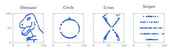
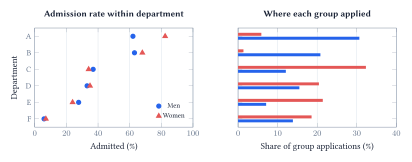
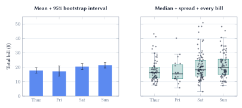
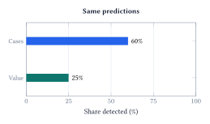
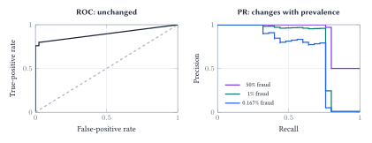
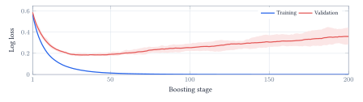
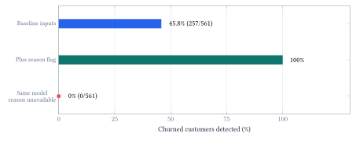
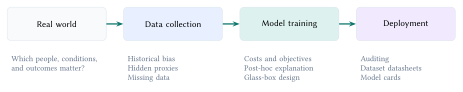

A number can be correct and still support the wrong conclusion. The central question is not simply whether a model scores well, but what the score leaves out and whether the evaluation resembles the decision we need to make.

::: {.lecture-note-actions role="navigation" aria-label="Lecture note navigation"}
[Course materials](../lectures/06-model-eval.qmd){.btn .btn-primary .btn-sm}
:::

::: {.callout-note appearance="simple"}
**Learning goals.** Inspect what summaries hide; compare models on a common population and meaningful error costs; audit what information was available when a prediction had to be made.
:::

## Look before you summarize

Summary statistics omit structure. A mean, standard deviation, or correlation describes only a small part of a dataset. Visualizing the observations can reveal patterns that these summaries leave out.

<figure class="lecture-06-figure">
<picture><source media="(max-width: 600px)" srcset="../assets/lecture-notes/lecture-06/datasaurus-mobile.svg"></picture>
<figcaption>Figure 1. Four of the notebook’s 13 deliberately constructed Datasaurus datasets, with 142 observations each. All have approximately <em>x̄</em> = 54.3, <em>ȳ</em> = 47.8, <em>s</em><em>x</em> = 16.8, <em>s</em><em>y</em> = 26.9, and correlation −0.06. Their structures are plainly different. Coordinates are the same as in the notebook.</figcaption>
</figure>

A correlation near zero does not imply the absence of a pattern. Before fitting or comparing models, inspect distributions, unusual cases, and relationships between variables. Then check whether the pattern changes when meaningful groups remain visible.

Ask what one point represents. A plot of people, transactions, or group averages can support very different conclusions.

The purpose of visualization is not to decorate an analysis. It is to expose structure that a compressed description would otherwise hide.

## An overall average mixes different worlds

For groups $g$, an overall rate is a weighted average:

$$
r_{\mathrm{overall}}=\sum_g w_g r_g,\qquad \sum_g w_g=1.
$$

 Both the within-group rates $r_g$ and population mix $w_g$ matter. Changing the mix can change an overall rate even when within-group performance is unchanged.

<figure class="lecture-06-figure">
<picture><source media="(max-width: 600px)" srcset="../assets/lecture-notes/lecture-06/berkeley-mobile.svg"></picture>
<figcaption>Figure 2. Berkeley’s six largest departments, 1973: aggregate admission rates are 44.5% for men and 30.4% for women. The two groups applied to different mixes of departments. These 4,526 applications do not cover the entire university or establish the causes of the gap.</figcaption>
</figure>

### The driving benchmark trap

Consider two *illustrative* driving systems. MPD means miles per disengagement; higher is better on this metric, but does not alone establish safety. Neither system represents a real company's results.

::: {.lecture-06-table role="region" aria-label="Driving benchmark comparison" tabindex="0"}

| Setting | Legacy MPD | Legacy miles driven | Next-generation MPD | Next-generation miles driven |
| --- | --- | --- | --- | --- |
| Highway | 1,000 | 100,000 | 2,000 | 2,000 |
| Urban | 10 | 1,000 | 20 | 100,000 |

: Table 1. The next-generation system doubles MPD within each setting, but its test is mostly urban. Miles driven determines each setting's exposure.

:::

Do not average the two MPD values. First recover disengagement counts as miles divided by MPD, then divide total miles by total disengagements:

$$
\begin{aligned}
\mathrm{MPD}_{\mathrm{legacy}}&=\frac{100{,}000+1{,}000}{100{,}000/1{,}000+1{,}000/10}=505,\\
\mathrm{MPD}_{\mathrm{next}}&=\frac{2{,}000+100{,}000}{2{,}000/2{,}000+100{,}000/20}\approx20.4.
\end{aligned}
$$

 The overall ranking reverses despite improvement in each setting. Report subgroup results and compare on a common, relevant operating mix. A benchmark headline such as 83% versus 72% is not enough without knowing the tasks, populations, and weighting behind it.

## Choose the comparison before the chart

Different charts preserve different information. A scatter plot keeps individual numeric pairs visible; a line additionally implies a meaningful order. Color can distinguish groups, while shape can repeat the same distinction for readability. Extra encodings are useful only when they help answer the question.

### Uncertainty in an average is not variation in the data

The restaurant example uses the same bills in both panels. A bar with an interval describes an estimated mean. A boxplot with observations describes the distribution of individual bills.

<figure class="lecture-06-figure">
<picture><source media="(max-width: 600px)" srcset="../assets/lecture-notes/lecture-06/tips-comparison-mobile.svg"></picture>
<figcaption>Figure 3. Real restaurant bills from the notebook’s tips dataset. First panel: mean and a reproducible 95% percentile bootstrap interval, computed with 5,000 resamples per day for this handout. Second panel: median, quartiles, whiskers, and all observations. The common dollar scale makes clear that uncertainty in the mean is much smaller than the spread of individual bills.</figcaption>
</figure>

The box contains the middle 50% of observations. Whiskers reach the most extreme observations within 1.5 interquartile ranges of the box; they need not reach the minimum and maximum. Friday has only 19 observations, compared with 87 on Saturday. Neither a neat mean nor a narrow interval makes this observational sample representative of every restaurant.

::: {.lecture-06-table role="region" aria-label="Visual vocabulary comparison" tabindex="0"}

| Question | Useful view | What to check |
| --- | --- | --- |
| How do two measurements vary together? | Scatter plot; grouped colors or shapes | One point's meaning; overlap; pooled versus within-group trends |
| What does one variable look like? | Histogram or KDE | Bin width or smoothing bandwidth; a smooth curve is not uniquely correct |
| How do two distributions connect? | Joint scatter with marginal histograms | Overlapping groups can become distinct in two dimensions |
| How does training change? | Loss curves with a labeled band | Ordered stages; what repeated trials the band represents |
| Which category is higher? | Bars or dots on a common baseline | Comparable scales; radar shape depends on axis order |

: Table 2. A compact guide to the notebook's visual walkthrough. Pick the graph that makes the intended comparison direct.

:::

## Count the errors, then count their consequences

In the notebook's fixed test split, 25 of 15,000 transactions are fraud. A model that always predicts legitimate achieves 99.833% accuracy while missing every fraud. The random forest reaches 99.913%; the important difference appears in the errors, not the small change in accuracy.

<figure class="lecture-06-figure">

<table><caption>Random forest: error counts</caption><thead><tr><th scope="col">Actual / predicted</th><th scope="col">Legitimate</th><th scope="col">Fraud</th></tr></thead><tbody><tr><th scope="row">Legitimate</th><td>14,972</td><td>3</td></tr><tr><th scope="row">Fraud</th><td>10</td><td>15</td></tr></tbody></table><picture><source media="(max-width: 600px)" srcset="../assets/lecture-notes/lecture-06/fraud-consequences-mobile.svg"></picture>

<figcaption>Figure 4. Verified results from the notebook’s fixed 50,000-transaction sample and stratified 70/30 split. The forest catches 15 of 25 frauds and raises three false alarms. Its detected share of fraudulent value is far below its detected share of cases.</figcaption>
</figure>

With fraud as the positive class, true positives (TP) are caught frauds, false negatives (FN) are missed frauds, and false positives (FP) are false alarms. Then

$$
\mathrm{Recall}=\frac{\mathrm{TP}}{\mathrm{TP}+\mathrm{FN}}=60\%,\qquad
\mathrm{Precision}=\frac{\mathrm{TP}}{\mathrm{TP}+\mathrm{FP}}=83.3\%.
$$

 Recall asks how many frauds we caught. Precision asks how many alerts were actually fraud. F1 combines these rates, but none of these measures represents financial consequences by itself.

The caught frauds total €1,309.20 out of €5,246.73: approximately 25% of fraudulent value. The missed frauds have a higher average value than the caught frauds. This is *value detected*, not proven savings; intervention effectiveness and false-alarm costs are not measured here.

### Align the objective with the decision

*Cost-sensitive learning* connects model design to the consequences of mistakes. If false positives and false negatives have costs $C_{\mathrm{FP}}$ and $C_{\mathrm{FN}}$, one evaluation is

$$
\mathrm{Cost}=C_{\mathrm{FP}}\,\mathrm{FP}+C_{\mathrm{FN}}\,\mathrm{FN}.
$$

 For a probability $p=P(Y=1\mid x)$ that is appropriate for the deployment population, predicting positive has expected cost $C_{\mathrm{FP}}(1-p)$; predicting negative has cost $C_{\mathrm{FN}}p$. With zero cost for correct decisions, choose positive when

$$
p>\frac{C_{\mathrm{FP}}}{C_{\mathrm{FP}}+C_{\mathrm{FN}}}.
$$

 Thus 0.5 is not a universal operating threshold. If costs vary by transaction, the decision may need to depend on the transaction too. Training weights can emphasize costly errors, but must still be checked with deployment-aligned validation and probability assessment.

## Population and validation change the story

Let $\pi=P(Y=1)$ be prevalence, TPR be recall, and FPR be the false-positive rate. The fraction of alerts that are genuine positives is

$$
\mathrm{Precision}=\frac{\pi\,\mathrm{TPR}}{\pi\,\mathrm{TPR}+(1-\pi)\,\mathrm{FPR}}.
$$

 The base rate matters even when the two class-conditional rates are unchanged.

<figure class="lecture-06-figure">
<picture><source media="(max-width: 600px)" srcset="../assets/lecture-notes/lecture-06/roc-pr-mobile.svg"></picture>
<figcaption>Figure 5. Reweighting the same model scores and labels changes prevalence. ROC stays fixed; precision–recall changes. This experiment assumes fixed within-class score distributions, not arbitrary distribution shift.</figcaption>
</figure>

At 80% recall and 1% FPR, 100 frauds and 99,900 legitimate transactions produce 80 genuine alerts and 999 false alarms: precision is only 7.4%. ROC is not lying; it does not directly answer how useful an alert will be.

### Use validation for choices, testing for the final check

Training fits parameters; validation chooses settings and thresholds; an untouched test set evaluates the selected procedure. With only 25 frauds in the current test, one additional detection changes recall by four percentage points.

<figure class="lecture-06-figure">
<picture><source media="(max-width: 600px)" srcset="../assets/lecture-notes/lecture-06/learning-curves-mobile.svg"></picture>
<figcaption>Figure 6. Wisconsin diagnostic data: five boosted-tree runs, 100 training records, one fixed stratified split. Lines show mean loss; bands show the range across seeds, not confidence intervals. Validation loss is lowest near stage 36, then rises while training loss falls.</figcaption>
</figure>

Choose splits that match the intended use: future periods for forecasting, disjoint people for new-patient prediction, and training-only fitting of preprocessing. The learning-curve demonstration uses validation to illustrate stopping; it does not reserve a final test set or establish clinical utility.

## Could we have known this in time?

A held-out row is not automatically a valid future prediction. In the notebook's IBM Telco sample, the presence of a *Churn Reason* is enough to reveal that the customer left. But the decision is to contact the customer *before* that happens.

<figure class="lecture-06-figure">
<picture><source media="(max-width: 600px)" srcset="../assets/lecture-notes/lecture-06/leakage-mobile.svg"></picture>
<figcaption>Figure 7. Same split and forest settings, with and without the reason-recorded flag. The final row keeps the flag-using model fixed but sets the flag to zero for all test records. It then catches none of the 561 churners. This intervention diagnoses reliance on unavailable information; it is not a measured deployment result.</figcaption>
</figure>

The baseline uses tenure, charges, and contract, catching 257 of 561 churners. Adding the flag yields a perfect test score. A random split cannot prevent this shortcut when the revealing feature is supplied to both training and test customers.

<figure class="lecture-06-figure">
<picture><source media="(max-width: 600px)" srcset="../assets/lecture-notes/lecture-06/timeline-mobile.svg"></picture>
<figcaption>Figure 8. The information boundary is temporal. A field can exist in the final spreadsheet without having existed at the decision point.</figcaption>
</figure>

### Repair the evaluation, not just the headline

Remove unavailable fields, rebuild the training procedure, and evaluate on data representing the later decision. The dataset is a fictional company snapshot, not a longitudinal record, so even the baseline features need an availability audit before they could support a real forecasting claim.

::: {.callout-warning appearance="simple"}
### Leakage is about access

The same issue appears when an AI agent can see answer-bearing files or conversation history. Holding out question IDs is not enough if the answers remain accessible. An evaluation must specify both the examples and the information the system can use.

:::

Do not confuse a perfect score with strong evidence. First ask how that score was possible, then test the suspected shortcut directly.

## Audit the system, not just the model

Real-world conditions shape data collection; data shape training; the trained system then acts in the world. A failure can originate at any of these steps.

<figure class="lecture-06-figure">
<picture><source media="(max-width: 600px)" srcset="../assets/lecture-notes/lecture-06/system-audit-mobile.svg"></picture>
<figcaption>Figure 9. Different audit questions require different responses. Explaining a model cannot recover people missing from the data or make a future-only feature available earlier.</figcaption>
</figure>

### Data can carry the problem into the model

Historical decisions can become labels that reproduce past practice rather than the desired outcome. A seemingly ordinary variable can act as a proxy for a sensitive attribute. Missing observations can change who is represented, and missingness itself can reveal the outcome, as in the churn example. Audit the collection and labeling process before treating the table as ground truth.

### Explanation is not the same as transparent design

*Post-hoc explainability* asks what a fitted model appears to rely on. It can suggest shortcuts to test, but is not proof of causation, fairness, or correctness. *Glass-box design* makes the model's structure directly inspectable. Transparency helps scrutiny; it does not repair biased data or a mismatched objective by itself.

### Make the evaluation travel with the system

A [dataset datasheet](https://arxiv.org/abs/1803.09010) records motivation, composition, collection, and intended uses. A [model card](https://arxiv.org/abs/1810.03993) records intended use, evaluation conditions, limitations, and relevant subgroup performance. They make assumptions inspectable, while deployment auditing checks whether those assumptions continue to hold.

::: {.callout-note appearance="simple"}

**The central question: what did the number leave out?** Inspect observations before trusting summaries, compare groups before comparing pooled scores, evaluate the consequences of errors, and enforce the information boundary of the real decision. A high score is useful evidence only when its population, costs, and evaluation conditions are clear.

:::

**Sources and scope.** Figures are native-LaTeX redrawings of the verified [Lecture 6 notebook (commit 5d512e1)](https://github.com/jinming99/learn-ml-by-building/tree/5d512e1) or clearly labeled conceptual examples. Datasaurus is deliberately constructed; the driving benchmark is illustrative; IBM Telco is fictional. The restaurant and credit-card examples use recorded observations. See also the [canonical Berkeley counts](https://www.stat.ethz.ch/R-manual/R-devel/library/datasets/html/UCBAdmissions.html), [Seaborn sample-data sources](https://github.com/mwaskom/seaborn-data), [IBM field descriptions](https://community.ibm.com/community/user/blogs/steven-macko/2019/07/11/telco-customer-churn-1113), and [Wisconsin dataset documentation](https://scikit-learn.org/stable/modules/generated/sklearn.datasets.load_breast_cancer.html). Dataset/model documentation follows Gebru et al., *Datasheets for Datasets*, and Mitchell et al., *Model Cards for Model Reporting*.

**Acknowledgment.** These notes are based on the instructor's handwritten notes and transcripts of lecture discussions and were editorially polished and typeset with assistance from OpenAI Codex and Anthropic Claude. The instructor reviewed and is responsible for the final content.
