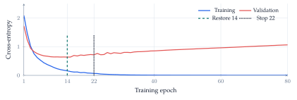
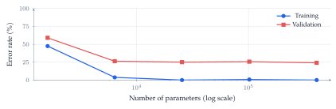
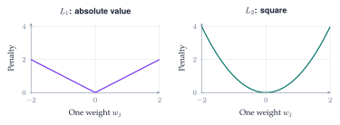
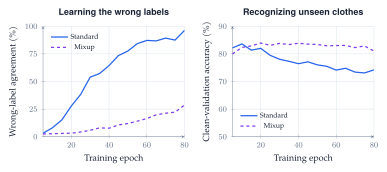
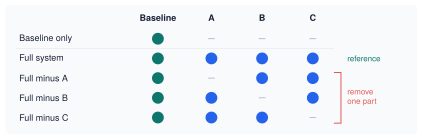

A clothing classifier can answer every training example correctly and still struggle with new images. Generalization requires a separate evaluation, controlled comparisons, and evidence that the improvement survives the conditions we care about.

::: {.lecture-note-actions role="navigation" aria-label="Lecture note navigation"}
[Course materials](../lectures/07-regularization.qmd){.btn .btn-primary .btn-sm}
:::

::: {.callout-note appearance="simple"}
**Learning goals.** Distinguish fitting from generalizing; use validation to diagnose overfitting and select a checkpoint; explain how data, weight penalties, and mixed targets change learning; isolate a component's contribution with a controlled comparison.
:::

## Which error are we trying to reduce?

The running example is [Fashion-MNIST](https://github.com/zalandoresearch/fashion-mnist): 28-by-28 grayscale images in ten clothing categories. A fitted model $h$ maps an image $x$ to a prediction. Let $\ell(h(x),y)$ measure its discrepancy from the true label $y$. Classification error counts wrong decisions; cross-entropy also scores the probability assigned to the correct class.

For training data $D=\{(x_i,y_i)\}_{i=1}^n$, empirical risk is

$$
\widehat L_{\mathrm{train}}(h)=\frac{1}{n}\sum_{i=1}^{n}\ell(h(x_i),y_i).
$$

 Learning chooses $h$ using these observations, so its training score is generally an optimistic estimate of performance on fresh examples.

The goal is small *population risk*, or generalization error, under the distribution $P$ of future examples:

$$
L_P(h)=\mathbb E_{(X,Y)\sim P}\bigl[\ell(h(X),Y)\bigr].
$$

 We cannot compute this expectation exactly because $P$ is unknown. An independent test sample $D_{\mathrm{test}}=\{(x'_i,y'_i)\}_{i=1}^{m}$ estimates it:

$$
\widehat L_{\mathrm{test}}(h)=\frac{1}{m}\sum_{i=1}^{m}\ell(h(x'_i),y'_i).
$$

 Test error estimates risk for the population the test sample represents. Sampling uncertainty and distribution shift remain even when the arithmetic is correct.

## Validation and early stopping

Training data fit the parameters. *Validation* data guide choices such as model width, penalty strength, and stopping time. The final test evaluates the chosen procedure after those choices are fixed. All three roles must remain distinct; repeatedly tuning to a test result turns that set into another validation set.

The notebook first reserves 5,000 validation images from the official training collection. Its opening experiment uses a stratified subset of 300 remaining images. The official 10,000-image test collection stays separate. Later experiments state their own training-set sizes.

<figure class="lecture-07-figure">

<figcaption>Figure 1. Measured cross-entropy from the notebook’s 300-image experiment.
Continued fitting lowers training loss while validation loss eventually
rises. The dashed marker identifies the checkpoint restored by early
stopping; the dotted marker identifies when training actually stops.</figcaption>
</figure>

*Overfitting* appears when improved fit to training observations fails to improve, or worsens, held-out performance. A gap between the two scores is useful evidence, but its size has no universal "severe" threshold. A growing validation loss can matter even while accuracy barely moves: the winning label can stay the same while a wrong prediction becomes more confident.

Early stopping monitors a validation score and waits a specified *patience* period without improvement. Stopping training and restoring the best weights are separate operations. Here, patience is eight epochs: training stops at epoch 22 and restores epoch 14.

| Checkpoint | Validation accuracy | Log loss $\downarrow$ |
| --- | --- | --- |
| Last, epoch 80 | 78.3% | 1.059 |
| Restored, epoch 14 | 78.6% | 0.637 |

Table 1. Restoring the earlier checkpoint mainly improves the probabilities, rather than the number of correct decisions.

With limited data, $k$-fold cross-validation repeats fitting with different held-out folds and aggregates the scores. It reveals sensitivity to the split at extra computational cost. Fold-to-fold variation alone does not establish overfitting, and preprocessing must be fitted inside each training fold.

## Model size and data coverage

Increasing training time follows one model through optimization. Increasing model size compares different models. These axes should not be confused. In the width experiment, each network sees the same 200 training images, the same validation collection, and the same number of epochs; only one hidden layer's width changes.

<figure class="lecture-07-figure">

<figcaption>Figure 2. Observed error versus parameter count, averaged over two
initializations. Training error approaches zero, while validation error
levels off instead of rising sharply. This is a small controlled
experiment, not a universal scaling law or a demonstration of a full
double-descent curve.</figcaption>
</figure>

The classical U-shaped validation-error sketch is one possible outcome, not an inevitable consequence of adding parameters. A larger network can represent more functions, but the fitted function also depends on optimization, data, and regularization. Under a fixed training budget, even achieving a lower training error is not guaranteed.

More distinct training examples can help. The notebook's nested-sample experiment holds architecture fixed while increasing the training collection from 100 to 20,000 images. Validation accuracy improves in that run, but equal epochs give larger datasets more gradient updates; the comparison does not hold computation fixed.

Coverage of the expected conditions matters too. In the lighting experiment, both methods receive the same 1,000 source images and all ten classes. One training collection uses the original images; the other applies simulated brightness and contrast changes.

| Training collection | Original lighting | Changed lighting |
| --- | --- | --- |
| Original images only | 81.5% | 29.2% |
| Varied lighting | 79.0% | 76.2% |

Table 2. Validation accuracy, averaged over two initializations. Relevant variation greatly helps under the specified lighting shift, with a small cost on the original images. These are simulated changes, not new photographs or arbitrary unseen shifts.

## Change the price of large weights

When collecting more data is difficult, we can change the training objective. For parameters $w$ and strength $\lambda\geq0$, regularized learning minimizes

$$
J(w)=\widehat L_{\mathrm{train}}(w)+\lambda\Omega(w),
\qquad
\Omega_{L_1}(w)=\sum_j|w_j|,\quad
\Omega_{L_2}(w)=\sum_j w_j^2.
$$

 The penalty expresses a preference over solutions. A *hard constraint*, such as $\lVert w\rVert_2\leq c$, forbids parameter values outside a feasible set. A soft penalty makes them costly; it does not forbid them or guarantee generalization.

<figure class="lecture-07-figure">
<picture><source media="(max-width: 600px)" srcset="../assets/lecture-notes/lecture-07/penalties-mobile.svg"></picture>
<figcaption>Figure 3. Conceptual per-weight penalties with unit strength. Away from zero,
<em>L</em>1 exerts a
constant-magnitude pull, while the <em>L</em>2 pull increases with
weight size. These shapes describe the penalty, not the full training
objective.</figcaption>
</figure>

For ordinary gradient descent with learning rate $\eta$, the $L_2$ update is

$$
w_j\leftarrow(1-2\eta\lambda)w_j
-\eta\frac{\partial\widehat L_{\mathrm{train}}}{\partial w_j}.
$$

 For $L_1$, the penalty contributes $\lambda\operatorname{sign}(w_j)$ when $w_j\neq0$; at zero, it has a subgradient rather than a unique derivative. $L_1$ can produce sparse solutions, but ordinary neural-network optimization need not land exactly at zero. A near-zero connection also does not necessarily remove an entire input feature.

| Penalty | Accuracy | Log loss $\downarrow$ | Near-zero weights |
| --- | --- | --- | --- |
| None | 78.0% | 1.063 | 0.1% |
| $L_1$, $\lambda=0.0005$ | 77.5% | 0.724 | 43.7% |
| $L_2$, $\lambda=0.005$ | 78.0% | 0.712 | 15.4% |

Table 3. Notebook results with the same 300 images and 80 epochs, averaged over two initializations. Near zero means $|w|<10^{-4}$ in hidden-layer kernels. Evaluation uses ordinary cross-entropy without adding the penalty.

Here, penalties change weight magnitudes and improve log loss without a substantial accuracy gain. Excessive regularization can underfit. The strengths were explored on validation data, not established as general defaults. The notebook uses Adam with an $L_2$ loss penalty; the simple gradient-descent shrinkage formula should not be identified with decoupled AdamW weight decay.

## Change what the model is asked to predict

Weight penalties modify the cost of a parameter choice. Label smoothing and mixup modify the training targets. Neither method changes the labels used to score clean validation predictions.

### Label smoothing and probability quality

Let $y$ be a one-hot vector over $K$ classes and $\mathbf 1$ the all-ones vector. Label smoothing with strength $\alpha$ uses

$$
\widetilde y=(1-\alpha)y+\frac{\alpha}{K}\mathbf 1.
$$

 For ten classes and $\alpha=0.1$, the labeled class receives $0.9+0.01=0.91$ and each other class receives $0.01$. This is a training preference, not an assertion that the true label has exactly 9% uncertainty.

A smaller confidence value is not automatically more trustworthy. Calibration asks whether predictions made with a given confidence are correct about that often. In a reliability diagram, points below the confidence-equals-accuracy diagonal are overconfident; points above it are underconfident. Binning also hides within-bin differences, so the notebook reports full-validation scores alongside the diagram.

| Training targets | Accuracy | Log loss $\downarrow$ | Brier $\downarrow$ |
| --- | --- | --- | --- |
| Hard labels | 83.0% | 0.772 | 0.271 |
| Smoothed labels | 81.8% | 0.661 | 0.279 |

Table 4. Same 1,000 training images and 60 epochs. Smoothing improves log loss, but accuracy and Brier score become slightly worse. The evidence does not support an unqualified improvement in every aspect of probability quality.

For prediction vector $p_i$ and true class index $c_i$, log loss is $-\log p_{i,c_i}$ and the multiclass Brier score is $\sum_{k=1}^{K}(p_{ik}-y_{ik})^2$, averaged over examples. Log loss is especially sensitive to assigning tiny probability to the true class.

### Mixup pairs an input blend with a target blend

[Mixup](https://arxiv.org/abs/1710.09412) creates training pairs between two observed examples:

$$
\widetilde x=\lambda x_i+(1-\lambda)x_j,\qquad
\widetilde y=\lambda y_i+(1-\lambda)y_j,
\quad\lambda\sim\operatorname{Beta}(\alpha,\alpha).
$$

 A blend that is 70% sneaker and 30% bag receives that same mixture as its target. It need not depict a plausible physical object. The assumption is that encouraging approximately linear predictions between examples is a useful inductive preference for this task.

The clean-label notebook comparison lowers log loss from 0.772 to 0.597, while accuracy changes from 83.0% to 81.9%. This motivates a sharper experiment: whether mixup can resist learning deliberately incorrect training labels.

## Mixup with incorrect training labels

Imagine a clothing catalog with incorrect tags. The experiment takes 5,000 training images and deliberately replaces 20% of their labels with different classes. This is simulated annotation noise, not a claim that Fashion-MNIST naturally contains that error rate. All validation labels remain unchanged.

Within each paired run, standard training and mixup share the images, corrupted labels, starting weights, batch order, optimizer, and 80-epoch budget. Mixup uses $\alpha=4$, which favors substantial blends. Three seeds vary initialization, ordering, and the corrupted-label realization. These settings were explored on validation data; the validation collection itself is shared across runs.

<figure class="lecture-07-figure">
<picture><source media="(max-width: 600px)" srcset="../assets/lecture-notes/lecture-07/mixup-mobile.svg"></picture>
<figcaption>Figure 4. Measured means over three paired runs. First panel: agreement with the
deliberately wrong training labels; increasing agreement means learning
those mistakes. Second panel: accuracy on the same clean validation images.
Standard training increasingly repeats the bad labels as its
clean-validation accuracy declines. Mixup resists this behavior over the
same budget.</figcaption>
</figure>

| Checkpoint rule | Method | Accuracy | Log loss $\downarrow$ |
| --- | --- | --- | --- |
| Epoch 80 | Standard | 74.2% | 1.368 |
| Epoch 80 | Mixup | 81.0% | 0.722 |
| Best logged validation loss | Standard | 83.4% | 0.630 |
| Best logged validation loss | Mixup | 83.7% | 0.634 |

Table 5. The final-checkpoint gain is 6.8 percentage points and occurs in all three paired runs. Choosing each run's best logged checkpoint, evaluated every five epochs, substantially narrows the accuracy difference.

::: {.callout-warning appearance="simple"}

**What this establishes.** Mixup limits memorization of wrong labels under the stated budget. An earlier standard-training checkpoint is also competitive. Checkpoints are selected and scored on the same validation set, so this is exploratory evidence, not an independent test estimate or proof that mixup always wins.

:::

The final test comparison returns to the original 1,000-image, clean-label experiment; the noisy-label models are excluded. Selection by validation log loss chooses mixup. Test log loss improves from 0.927 to 0.672, while accuracy changes from 80.5% to 79.6%. The conclusion must remain tied to the metric used for selection.

## Isolate the effect of a component

Suppose a proposed system adds components $A$, $B$, and $C$ to a baseline. Comparing only the baseline with the complete system measures their combined effect. It does not identify which component helped. An *ablation study* removes a component while holding the rest of the system fixed.

Establish a baseline, evaluate the full system, and then run drop-one-out variants. The resulting design is:

<figure class="lecture-07-figure">

<figcaption>Figure 5. Conceptual ablation design. A filled circle means the component is
present. The baseline is retained in every row. No numerical outcomes
are assumed; the matrix specifies the comparisons to run.</figcaption>
</figure>

If $S$ is a score for which larger is better, define

$$
\Delta_A=S(\mathrm{full})-S(\mathrm{full}\setminus A).
$$

 A positive $\Delta_A$ means that including $A$ helps *in the presence of $B$ and $C$*, under this evaluation. For a loss, reverse the subtraction so a positive change still denotes a benefit. Keep the data split, metric, tuning policy, and training budget comparable; paired seeds help separate the component's effect from training randomness.

Interactions matter. Two components may be substitutes or work well only together, so the drop-one-out effects need not sum to the full system's gain over baseline. A small ablation effect does not establish that a component is useless in every configuration. If removing a component triggers retuning, state that explicitly: it answers a different question from a fixed-settings ablation.

The notebook's separate L1, L2, smoothing, and mixup comparisons isolate individual changes relative to their stated references; they are not a completed full-system ablation. The noisy-label example also shows why a strong baseline matters: comparing mixup only with a late, overfitted checkpoint would omit the competitive earlier checkpoint.

**Further reading and evidence.** The [Lecture 7 notebook](https://github.com/jinming99/learn-ml-by-building/blob/main/Lecture%207%20Regularization%20and%20Generalization/07-Overfitting-Regularization.ipynb) contains the code and full experiment outputs. Numerical results here correspond to the locally verified September 23--24 run; seeds and finite validation samples do not establish universal effects. Data: [Fashion-MNIST](https://github.com/zalandoresearch/fashion-mnist). Method: Zhang et al., [*mixup: Beyond Empirical Risk Minimization*](https://arxiv.org/abs/1710.09412). Cybersecurity connection: [*Zero-day Attack Detection in Digital Substations using In-Context Learning*](https://ieeexplore.ieee.org/document/10738025/). The clothing experiment does not establish that paper's application-specific claims.

**Acknowledgment.** Prepared for instructor review from the instructor's handwritten notes, lecture discussion transcript, and current notebook, with editorial and typesetting assistance from OpenAI Codex.

**In one sentence:** use held-out evidence to distinguish fitting from generalizing, and use controlled comparisons to establish what each intervention actually improves.
