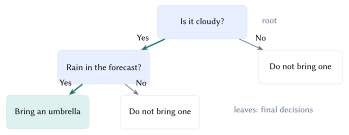
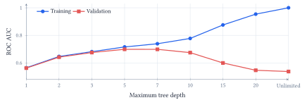
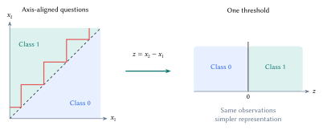
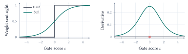
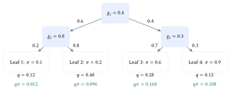

::: {.lecture-note-actions role="navigation" aria-label="Lecture note navigation"}
[Course materials](../lectures/08-decision-trees.qmd){.btn .btn-primary .btn-sm}
:::

::: {.callout-note appearance="simple"}
**Learning goals.** Choose a split using impurity; diagnose the effect of depth and representation; trace a soft prediction through its path weights; distinguish routing, predicted risk, and a class decision.
:::

## Which question should come next?

Deciding whether to bring an umbrella can be expressed as a small tree. Start at the *root*, answer a question at each internal node, and follow a branch until reaching a *leaf*. A path is a conjunction of conditions: cloudy *and* rain in the forecast, for example.

<figure class="lecture-08-figure">

<figcaption>Figure 1. A conceptual decision rule from the whiteboard. Internal nodes ask questions; leaves return a decision. Learning a tree means choosing the questions and leaf predictions from data. <a class="figure-enlarge" href="../assets/lecture-notes/lecture-08/umbrella.svg" target="_blank" rel="noopener" aria-label="Enlarge Figure 1">Enlarge</a></figcaption>
</figure>

For learning, imagine ten past days: five rainy ($R$) and five not rainy ($N$). A useful question separates them into groups with more consistent labels. If class $c$ occupies fraction $p_c$ of a node, its Gini impurity is

$$
G=1-\sum_{c=1}^{C}p_c^2.
$$

 A pure node has $G=0$. The 5/5 root has $G=1-0.5^2-0.5^2=0.50$. The point of a split is to reduce impurity across *both* children, accounting for their sizes.

## Learn a split, then decide when to stop

For a parent with $n$ examples and children with $n_L,n_R$ examples, score a candidate question by its reduction in weighted impurity:

$$
\Delta G=G_{\mathrm{parent}}-\frac{n_L}{n}G_L-\frac{n_R}{n}G_R.
$$

 The whiteboard compares two questions on the same ten days. Both produce two groups of five; the groups differ in how well they separate the outcomes.

  **Question**     **Left group**   **Right group**     **After split**   **Gain**
  ---------------- ---------------- ----------------- ----------------- ----------
  Cloudy?          $4R,1N$          $1R,4N$                        0.32       0.18
  Rain forecast?   $3R,2N$          $2R,3N$                        0.48       0.02

**Table 1.** The first question wins this local comparison. For a 4/1 group, $G=1-(4/5)^2-(1/5)^2=0.32$. These are illustrative counts, not weather measurements.

Entropy, $H=-\sum_c p_c\log p_c$ with $0\log0=0$, is another impurity measure. The learner can maximize its weighted reduction instead. A greedy tree chooses a useful split now, then repeats within each child; this does not guarantee the best complete tree.

<figure class="lecture-08-figure">

<figcaption>Figure 2. Measured ROC AUC from the current Home Credit notebook: the same 60,000 training applications and ten features, with 61,502 validation applications. Depth five has the highest validation AUC among the settings tried. <a class="figure-enlarge" href="../assets/lecture-notes/lecture-08/depth.svg" target="_blank" rel="noopener" aria-label="Enlarge Figure 2">Enlarge</a></figcaption>
</figure>

Extra splits eventually fit details that do not transfer. Maximum depth, minimum leaf size, and pruning limit this flexibility; validation guides the choice. A pure training leaf can still make mistakes on new cases. The curve above measures ranking, so a training AUC of one says nothing by itself about trustworthy probability estimates.

The target here is recorded *payment difficulties*, not whether a loan should be approved. A leaf estimates risk from its training examples; a threshold converts that estimate into a flag. Lowering the threshold changes decisions without changing the tree. Resampling or class weighting changes the fit itself and can change the meaning of its scores. All evaluation must retain the population proportions of interest.

## Simpler coordinates, smoother decisions

A standard numerical split asks whether one feature is below a threshold. In two dimensions, its boundaries follow the axes. A diagonal rule can therefore need many rectangular regions.

<figure class="lecture-08-figure">

<figcaption>Figure 3. Conceptual geometry of the notebook’s controlled rule, <em>y</em> = 1 when <em>x</em>2 &gt; <em>x</em>1. Axis-aligned regions approximate the diagonal with a staircase. In the feature <em>z</em> = <em>x</em>2 − <em>x</em>1, the same rule is a single threshold at zero. The staircase shown is illustrative, not a fitted model output. <a class="figure-enlarge" href="../assets/lecture-notes/lecture-08/coordinates.svg" target="_blank" rel="noopener" aria-label="Enlarge Figure 3">Enlarge</a></figcaption>
</figure>

An *oblique* split learns a score $s=\mathbf w^{\mathsf T}\mathbf x+b$ and compares it with zero. Changing which features a question uses is separate from changing how sharply it routes an input. A hard oblique split still sends the input down only one branch.

<figure class="lecture-08-figure">

<figcaption>Figure 4. A hard switch versus sigmoid routing at temperature <em>T</em> = 1. The soft derivative tells us how a small change in the gate score changes the right-branch weight. Hard routing has derivative zero away from zero and no derivative at the switch. <a class="figure-enlarge" href="../assets/lecture-notes/lecture-08/gates.svg" target="_blank" rel="noopener" aria-label="Enlarge Figure 4">Enlarge</a></figcaption>
</figure>

For temperature $T>0$, a soft gate sends weight $g(\mathbf x)=\sigma(s/T)$ to the right and $1-g(\mathbf x)$ to the left, where $\sigma(u)=1/(1+e^{-u})$. Its derivative is $g(1-g)/T$. This permits gradient-based learning; saturated gates can still have tiny gradients. Lower temperatures sharpen the gate, concentrating its derivative near the boundary.

The gate value is a *routing weight*. A right-branch weight of 80% does not mean an 80% probability of payment difficulties. That prediction also depends on what the leaves predict.

## Multiply along paths, add across leaves

For leaf $\ell$, its path weight $q_\ell(x)=P(\ell\mid x)$ is the product of branch weights: $g_n(x)$ at right turns and $1-g_n(x)$ at left turns. These weights sum to one. With leaf class probability $\pi_{\ell,c}$,

$$
P(y=c\mid x)=\sum_\ell q_\ell(x)\pi_{\ell,c}.
$$

<figure class="lecture-08-figure">

<figcaption>Figure 5. Numerical illustration, not a fitted applicant. Multiply along each path, then multiply by its leaf probability. The four contributions sum to 0.384. <a class="figure-enlarge" href="../assets/lecture-notes/lecture-08/routing.svg" target="_blank" rel="noopener" aria-label="Enlarge Figure 5">Enlarge</a></figcaption>
</figure>

If every leaf predicts 80%, their mixture also predicts 80%. Conversely, one hard path can end at a 50/50 leaf. Routing concentration is not class certainty.

The notebook fits three oblique gates and four leaves, selecting a checkpoint and seed by validation log loss. All models use 60,000 training applications; the 61,503 test applications remain separate from selection.

  **Test model**                **AP $\uparrow$**   **Log loss $\downarrow$**   **Brier $\downarrow$**
  --------------------------- ------------------- --------------------------- ------------------------
  Hard, four leaves                         0.138                       0.266                   0.0716
  Hard, selected depth five                 0.174                       0.266                   0.0707
  Soft, four leaves                         0.216                       0.254                   0.0693

**Table 2.** Verified test results. Average precision (AP) measures ranking; log loss and Brier score evaluate probabilities. Equal leaf counts do not mean equal capacity: soft gates combine all ten features.

The soft tree improves these scores, but this does not isolate softness or establish a universal winner. The notebook's hard-routing switch isolates routing more directly by fixing the learned gates and leaves.

A differentiable feature extractor can feed the soft tree, letting prediction-loss gradients update both. This input--features--tree--prediction chain is trainable end to end, but learned features and oblique questions can reduce interpretability.

**Evidence and reading.** [Lecture 8 notebook](https://github.com/jinming99/learn-ml-by-building/blob/main/Lecture%208%20Modern%20Decision%20Trees/08-DecisionTrees-ModernView.ipynb); [Home Credit data](https://www.kaggle.com/competitions/home-credit-default-risk/data); [Frosst & Hinton (2017), soft decision trees](https://arxiv.org/abs/1711.09784). These historical data are classroom examples, not a lending policy.

**Acknowledgment.** Prepared for instructor review from the instructor's handwritten notes, supporting lecture transcript, and current notebook, with editorial and typesetting assistance from OpenAI Codex.
