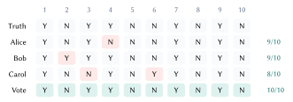
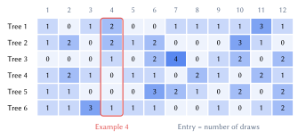
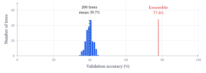
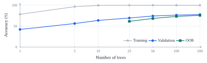
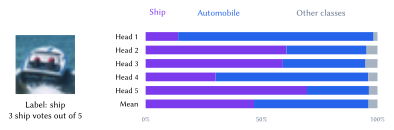
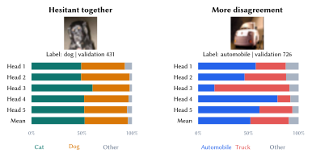

::: {.lecture-note-actions role="navigation" aria-label="Lecture note navigation"}
[Course materials](../lectures/09-ensemble.qmd){.btn .btn-primary .btn-sm}
:::

::: {.callout-note appearance="simple"}
**Learning goals.** Explain why different mistakes can help a committee; identify eligible OOB voters; distinguish class votes from probability averages; interpret disagreement without treating it as a guarantee of reliability.
:::

## Where the mistakes occur matters

Consider three doctors answering the same ten yes/no questions. Alice and Bob each make one mistake; Carol makes two. Their mistakes fall on different patients, so the other two doctors correct each error through a majority vote.

<figure class="lecture-09-figure">

<figcaption>Figure 1. The whiteboard’s conceptual example, not a clinical experiment. Coral cells mark errors. No column contains two errors, so the majority gets all ten answers right even though no individual does. <a class="figure-enlarge" href="../assets/lecture-notes/lecture-09/doctors.svg" target="_blank" rel="noopener" aria-label="Enlarge Figure 1">Enlarge</a></figcaption>
</figure>

What matters is *which examples* each predictor gets wrong. If all three miss the same patient, voting preserves that mistake. Useful diversity means complementary information from capable predictors, not arbitrary disagreement. Identical copies add neither.

For $M$ classifiers with predicted labels $h_m(x)$, class voting chooses

$$
\widehat y(x)=\operatorname*{arg\,max}_c\sum_{m=1}^{M}\mathbf{1}\{h_m(x)=c\}.
$$

 In a binary problem with an odd number of voters, the winner has a majority. With several classes, the largest count can win without exceeding half. A tie requires a specified rule.

## Build different trees from the same data

*Bagging* combines bootstrap sampling with aggregation. For each tree, draw $n$ times with replacement from the $n$ training rows. Repeated rows influence its fit; undrawn rows are *out of bag* for that tree. Train the members separately, then combine their predictions.

<figure class="lecture-09-figure">

<figcaption>Figure 2. The notebook’s fixed bootstrap example: each row contains 12 draws from 12 examples. Numbers count draws, not predicted labels. Example 4 is eligible for an OOB prediction from trees 4 and 5 only, because their entries in that column are zero. <a class="figure-enlarge" href="../assets/lecture-notes/lecture-09/oob.svg" target="_blank" rel="noopener" aria-label="Enlarge Figure 2">Enlarge</a></figcaption>
</figure>

For a particular example, the chance of being omitted on one draw is $1-1/n$. Across $n$ independent draws,

$$
\begin{aligned}P(\text{out of bag})&=\left(1-\frac1n\right)^n\\
&\longrightarrow e^{-1}\approx0.368.\end{aligned}
$$

 The finite example above has omission probability $(11/12)^{12}\approx35.2\%$. The familiar 36.8% is a large-$n$ limit. It is an expected omission fraction, *not an error rate* and not an exact quota for every tree.

To score training row $i$, combine only trees whose bootstrap samples excluded it; then compare that prediction with $y_i$. Repeat across rows to obtain an OOB score. Each row has its own eligible committee. With too few trees, some rows have no eligible voter; the notebook omits an OOB score until every row has one.

## Randomize the candidate features too

Bootstrap samples can still produce similar trees when one strong feature dominates. A random forest considers a fresh random subset of features *at each split*, then searches for a useful split among those candidates. It does not choose one permanent feature subset for an entire tree. The notebook uses the square-root feature rule with 512 image features.

::: {.callout-note appearance="simple"}

OOB predictions exclude a row from each eligible tree's fit. They do not protect against information leaking through preprocessing or repeated tuning to the OOB score. A final independent evaluation still has a separate role.

:::

## A committee beyond its best member

The notebook uses 4,000 training and 1,000 validation images from CIFAR-10's official training collection, balanced across ten classes. A fixed ImageNet-pretrained ResNet-18 maps each image to 512 features. The forest learns on these features; the image encoder is not trained here. A separate 1,000-image test subset is reserved and is not used for the comparisons below.

<figure class="lecture-09-figure">

<figcaption>Figure 3. Observed accuracies of 200 trees and their class-vote ensemble on the same 1,000 validation images. The ensemble’s 77.8% is the accuracy of the combined decisions; it is not the average of individual accuracies. <a class="figure-enlarge" href="../assets/lecture-notes/lecture-09/members.svg" target="_blank" rel="noopener" aria-label="Enlarge Figure 3">Enlarge</a></figcaption>
</figure>

Every tree scores between 34.8% and 44.3%, yet the committee reaches 77.8%. For one frog image, only 59 trees vote frog. Bird gets 41, airplane 21, cat 20, and the remaining 59 votes are spread among six other classes. Frog wins by *plurality*. The other classes must be considered separately, not merged into a single opponent.

<figure class="lecture-09-figure">

<figcaption>Figure 4. Measured prefixes of the same forest: earlier trees stay fixed as new ones are added. Training reaches 100% while validation still improves. OOB predictions use fewer trees per example and need not match validation exactly. <a class="figure-enlarge" href="../assets/lecture-notes/lecture-09/forest-size.svg" target="_blank" rel="noopener" aria-label="Enlarge Figure 4">Enlarge</a></figcaption>
</figure>

The largest gains come early in this run: validation rises from 42.1% with one tree to 69.5% with 25. Increasing 100 to 200 trees adds 1.4 percentage points. This suggests diminishing returns here, not a universal best forest size. Adding trees averages more fitted predictors; it does not make each tree deeper.

The explicit vote demonstration counts labels. Scikit-learn's forest prediction averages class probabilities; the two rules happen to score the same 77.8% in this run. Shared mistakes remain: for a truck image, 133 trees vote automobile and only 55 vote truck.

## An average can overrule the vote

For the neural committee, the notebook standardizes the fixed features using training data only and trains five small classifiers. They share the training images but use seeds 11, 22, 33, 44, and 55, giving different initial weights, batch orders, and dropout realizations. Each restores its lowest-validation-log-loss checkpoint.

If model $m$ predicts probability vector $p_m(x)$, equal-weight averaging gives

$$
\begin{aligned}\bar p_c(x)&=\frac1M\sum_{m=1}^{M}p_{m,c}(x),\\
\widehat y(x)&=\operatorname*{arg\,max}_c\bar p_c(x).\end{aligned}
$$

 All models receive the same weight. A strong probability preference has more effect than a narrow preference because we retain the full vectors instead of reducing each to one vote.

<figure class="lecture-09-figure">

<figcaption>Figure 5. A real held-out CIFAR-10 image, validation index 175 (source training ID 3038), with dataset label ship. Three of the five heads choose ship, yet their mean assigns about 49.4% to automobile and 46.8% to ship. Bars retain all probability; other classes are grouped, not discarded. <a class="figure-enlarge" href="../assets/lecture-notes/lecture-09/ship-votes.svg" target="_blank" rel="noopener" aria-label="Enlarge Figure 5">Enlarge</a></figcaption>
</figure>

This example reverses the decision: class voting matches the dataset label, while averaging probabilities does not. More information in the aggregation rule does not guarantee that every prediction improves. The whiteboard's hypothetical truck/automobile calculation illustrates the same mechanism; this figure supplies an actual model example.

Across validation, the average has 83.1% accuracy, below the best individual's 83.8%, but its log loss is lower: about 0.492 versus 0.498--0.513 for the members. Accuracy asks which class wins; log loss also asks how much probability the true class receives. An improvement in one metric need not improve the other.

These heads share an encoder, so they also share its limitations. They are a compact teaching version of a neural ensemble, not five independently trained end-to-end vision systems.

## Similar confidence, different reasons

These two validation images have similar maximum mean probabilities, but the members reach them differently.

<figure class="lecture-09-figure">
<a href="../assets/lecture-notes/lecture-09/opinions.svg" target="_blank" rel="noopener" title="Open full-size figure" aria-label="Enlarge Figure 6"><picture><source media="(max-width: 600px)" srcset="../assets/lecture-notes/lecture-09/opinions-mobile.svg"></picture></a>
<figcaption>Figure 6. Actual validation predictions. First: all five heads favor cat; the label is dog. Second: one favors truck, the others automobile, matching the label. The maximum mean probabilities are similar (52.9% and 52.0%), not the full mean distributions. <a class="figure-enlarge" href="../assets/lecture-notes/lecture-09/opinions.svg" target="_blank" rel="noopener" aria-label="Enlarge Figure 6">Enlarge</a></figcaption>
</figure>

For a distribution $p$ over $C$ classes, entropy is $H(p)=-\sum_{c=1}^C p_c\log p_c$. Using natural logarithms gives units of nats. The exact decomposition is

$$
\begin{aligned}
\underbrace{H(\bar p)}_{\text{total uncertainty}}
&=\underbrace{\frac1M\sum_m H(p_m)}_{\text{within members}}\\
&\quad+\underbrace{\left[H(\bar p)-\frac1M\sum_m H(p_m)\right]}_{\text{disagreement}}.
\end{aligned}
$$

Identical distributions give zero disagreement; sharing a top-ranked class is not enough. Here disagreement rises from 0.008 to 0.106 nats, while within-member uncertainty remains larger in both (0.832 and 0.868 nats).

Within-member uncertainty is often associated with *aleatoric* uncertainty (ambiguity or noise); disagreement with *epistemic* uncertainty (limited knowledge). These are model-based signals, not proof that an image is irreducibly ambiguous or that more data will resolve it.

Agreement can also be confidently wrong. In another selected validation image, all five heads choose bird and the mean exceeds 99.9%, while the dataset label is dog. The mismatch calls for inspecting both the image and its label. Neither agreement nor probability averaging guarantees correctness or calibration.

**Evidence and reading.** [Lecture 9 notebook](https://github.com/jinming99/learn-ml-by-building/blob/main/Lecture%209%20Ensemble%20Methods/09-Ensemble-Methods.ipynb); [CIFAR-10](https://www.cs.toronto.edu/~kriz/cifar.html); [Lakshminarayanan et al. (2017), deep ensembles](https://proceedings.neurips.cc/paper/2017/hash/9ef2ed4b7fd2c810847ffa5fa85bce38-Abstract.html). Selected images explain mechanisms; they do not estimate how often those situations occur.

**Acknowledgment.** Prepared for instructor review from the instructor's handwritten notes, supporting lecture transcript, and current notebook, with editorial and typesetting assistance from OpenAI Codex.

**In one sentence:** combine useful predictors with different mistakes, and inspect their individual probabilities before treating a confident average as a trustworthy answer.
