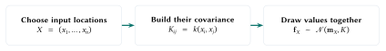
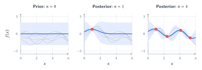
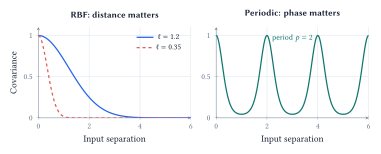
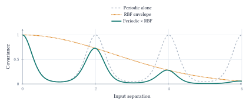
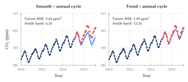
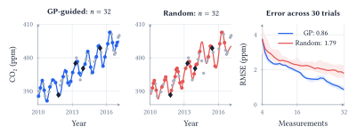

::: {.lecture-note-actions role="navigation" aria-label="Lecture note navigation"}
[Course materials](../lectures/10-kernel-gp.qmd){.btn .btn-primary .btn-sm}
:::

::: {.callout-note appearance="simple"}
**Learning goals.** Describe a distribution over functions; distinguish conditioning from hyperparameter fitting; build kernels for smoothness, trends and cycles; evaluate uncertainty and use it to guide sampling.
:::

## What can a few measurements tell us?

The notebook begins with ten Mauna Loa CO~2~ observations. Interpolation requires assumptions about change between measurements; forecasting requires assumptions about which patterns persist. Supplying an annual cycle is useful knowledge, but it is different from discovering one from ten measurements.

A Gaussian process (GP) places a probability distribution over functions. It specifies a mean function $m(x)$ and a covariance function $k(x,z)$, called the *kernel*. For any finite collection of inputs $X=(x_1,\ldots,x_n)$,

$$
\begin{aligned}
\mathbf f_X&=(f(x_1),\ldots,f(x_n))^\top
            \sim\mathcal N(\mathbf m_X,K),\\
(\mathbf m_X)_i&=m(x_i),\qquad K_{ij}=k(x_i,x_j).
\end{aligned}
$$

 This finite-dimensional rule is the definition of $f\sim\mathcal{GP}(m,k)$. Each $f(x_i)$ is a random variable. Their *joint* distribution matters: drawing unrelated Gaussian values at each input would lose the relationships encoded by the kernel.

<figure class="lecture-10-figure">
<a href="../assets/lecture-notes/lecture-10/draw-function.svg" target="_blank" rel="noopener" aria-label="Enlarge Figure 1"><picture><source media="(max-width: 600px)" srcset="../assets/lecture-notes/lecture-10/draw-function-mobile.svg" width="213.613" height="163.387"></picture></a>
<figcaption>Figure 1. Drawing one function on a grid means drawing one correlated Gaussian vector and plotting its entries. The grid is finite; the GP defines compatible distributions for any finite set of inputs. <a class="figure-enlarge" href="../assets/lecture-notes/lecture-10/draw-function.svg" target="_blank" rel="noopener" aria-label="Enlarge Figure 1">Enlarge</a></figcaption>
</figure>

If $K=LL^\top$ and $\mathbf z\sim\mathcal N(0,I)$, then $\mathbf m_X+L\mathbf z$ gives one such draw. The prior weights possible function values unequally. Observations update this distribution; the posterior mean summarizes it without showing every plausible curve.

## Keep the assumption. Add an observation.

Let $\mathcal D=(X,\mathbf y)$ denote the observations, with

$$
y_i=f(x_i)+\epsilon_i,\qquad
\epsilon_i\overset{\mathrm{iid}}\sim\mathcal N(0,\sigma_n^2).
$$

 Bayes' rule updates the prior using the likelihood of the observed values:

$$
p(\mathbf f_X\mid X,\mathbf y)
\propto p(\mathbf y\mid\mathbf f_X,X)\,p(\mathbf f_X\mid X).
$$

 The inputs are known. We update beliefs about function values, not a distribution over the input dates. With nonzero observation noise, a curve that misses a dot is less plausible, not automatically impossible.

<figure class="lecture-10-figure">
<a href="../assets/lecture-notes/lecture-10/conditioning.svg" target="_blank" rel="noopener" aria-label="Enlarge Figure 2"><picture><source media="(max-width: 600px)" srcset="../assets/lecture-notes/lecture-10/conditioning-mobile.svg" width="233.087" height="391.734"></picture></a>
<figcaption>Figure 2. The notebook’s illustrative observations, not CO2 data. All panels use the same RBF kernel, length scale 0.8, and noise standard deviation 0.1. Gray curves are draws; blue shows the mean and a 95% pointwise interval for <em>f</em>(<em>x</em>). New evidence reduces uncertainty where the kernel connects inputs. <a class="figure-enlarge" href="../assets/lecture-notes/lecture-10/conditioning.svg" target="_blank" rel="noopener" aria-label="Enlarge Figure 2">Enlarge</a></figcaption>
</figure>

For one new input $x_*$, define $\mathbf k_*=(k(x_1,x_*),\ldots,k(x_n,x_*))^\top$ and $A=K+\sigma_n^2I$. Gaussian conditioning gives

$$
\begin{aligned}
f(x_*)\mid\mathcal D&\sim\mathcal N(\mu_*,s_f^2(x_*)),\\
\mu_*&=m(x_*)+\mathbf k_*^\top A^{-1}(\mathbf y-\mathbf m_X),\\
s_f^2(x_*)&=k(x_*,x_*)-\mathbf k_*^\top A^{-1}\mathbf k_*.
\end{aligned}
$$

 The mean adjusts the prior using the observed residuals. The variance subtracts what the observations tell us about $x_*$. Both depend on covariance with the observed inputs. An RBF kernel transfers information locally; a periodic kernel can transfer it to a distant point in the same phase of a cycle.

With the mean, kernel parameters, and noise fixed, this update requires linear algebra rather than an optimization over candidate curves. Implementations solve linear systems, usually through a Cholesky factorization, instead of explicitly forming $A^{-1}$. Dense exact GP fitting uses roughly $O(n^3)$ computation and $O(n^2)$ storage.

::: {.callout-note appearance="simple"}

The interval $\mu_*\pm1.96s_f(x_*)$ concerns the underlying function. For a new noisy measurement, use variance $s_y^2(x_*)=s_f^2(x_*)+\sigma_n^2$. Neither interval promises that 95% of an entire curve lies inside its band simultaneously.

:::

## What does "nearby" mean?

A kernel is often introduced as a similarity function. In a GP it has a precise job:

$$
k(x,z)=\operatorname{Cov}(f(x),f(z)).
$$

 It must be symmetric and make $K$ positive semidefinite for every finite input set: $\mathbf a^\top K\mathbf a\geq0$ for every vector $\mathbf a$. An arbitrary similarity score need not satisfy this condition. One valid construction is $k(x,z)=\phi(x)^\top\phi(z)$, since then $\mathbf a^\top K\mathbf a=\|\sum_i a_i\phi(x_i)\|^2\geq0$.

Common kernel families encode different relationships. With input vectors $x,z$, or scalar times $t,s$ for the periodic kernel,

$$
\begin{aligned}
k_{\mathrm{lin}}(x,z)&=x^\top z,\\
k_{\mathrm{poly}}(x,z)&=(\gamma x^\top z+c)^d,\\
k_{\mathrm{RBF}}(x,z)&=\sigma_f^2\exp\!\left(-\frac{\|x-z\|^2}{2\ell^2}\right),\\
k_{\mathrm{per}}(t,s)&=\sigma_f^2\exp\!\left(-\frac{2\sin^2(\pi|t-s|/p)}{\ell_p^2}\right).
\end{aligned}
$$

 Here $\gamma,c\geq0$ and $d$ is a positive integer. The scales $\ell,\ell_p$ and period $p$ are positive. The linear kernel models linear variation; the polynomial kernel represents higher-order feature interactions without explicitly listing the expanded features. An added constant term in a linear kernel allows a random intercept.

<figure class="lecture-10-figure">
<a href="../assets/lecture-notes/lecture-10/kernel-profiles.svg" target="_blank" rel="noopener" aria-label="Enlarge Figure 3"><picture><source media="(max-width: 600px)" srcset="../assets/lecture-notes/lecture-10/kernel-profiles-mobile.svg" width="230.950" height="285.889"></picture></a>
<figcaption>Figure 3. Covariance profiles computed from the formulas, with unit signal variance. A short RBF length scale limits the reach of an observation. A periodic kernel restores high covariance at every multiple of the period, however far away. These are covariance curves, not fitted predictions. <a class="figure-enlarge" href="../assets/lecture-notes/lecture-10/kernel-profiles.svg" target="_blank" rel="noopener" aria-label="Enlarge Figure 3">Enlarge</a></figcaption>
</figure>

For the RBF kernel, a small $\ell$ allows rapid variation; a large $\ell$ favors changes over longer distances. Both produce smooth functions. "More wiggly" does not mean mathematically jagged. Input units matter: a length scale of 0.25 means three months when time is measured in years.

The period $p$ controls *when* a pattern repeats; $\ell_p$ controls how quickly covariance falls within a cycle. High covariance is not always the same as high correlation: correlation also divides by the marginal standard deviations. The unit-variance curves above make the two coincide.

## Build the assumptions into the kernel

A useful model combines a trend with a seasonal pattern that can change gradually:

$$
k_{\mathrm{total}}(t,s)=k_{\mathrm{trend}}(t,s)
                 +k_{\mathrm{per}}(t,s)\,k_{\mathrm{local}}(t,s).
$$

 Both sums and pointwise products of valid kernels are valid. They describe different structures. If independent GP components $g$ and $h$ add to give $f=g+h$, then their covariances add. A trend-plus-season model can therefore express two contributions to the same observation. Addition does not mean choosing one pattern *or* the other.

Multiplying the periodic kernel by a long-scale RBF kernel weakens the connection between cycles as they become more distant. Dates in the same season remain related, but the seasonal shape is allowed to drift. This is a covariance construction; it does not require claiming that the product of two GP sample functions is itself a GP.

<figure class="lecture-10-figure">
<a href="../assets/lecture-notes/lecture-10/local-periodic.svg" target="_blank" rel="noopener" aria-label="Enlarge Figure 4"><picture><source media="(max-width: 600px)" srcset="../assets/lecture-notes/lecture-10/local-periodic-mobile.svg" width="230.950" height="179.333"></picture></a>
<figcaption>Figure 4. A locally periodic kernel, shown directly in covariance space. The periodic component alone gives equal-strength peaks forever. Multiplying it by an RBF envelope makes the peaks decay. Here the period is 2 and the envelope length scale is 2.5 in illustrative input units; this is not a fitted CO2 result. <a class="figure-enlarge" href="../assets/lecture-notes/lecture-10/local-periodic.svg" target="_blank" rel="noopener" aria-label="Enlarge Figure 4">Enlarge</a></figcaption>
</figure>

**Three distinct roles in learning.** Choosing a kernel encodes assumptions about plausible functions. Conditioning uses observed values to update the distribution while those assumptions remain fixed. Fitting hyperparameters adjusts quantities such as length scale, amplitude, period, or noise level within the chosen model family.

For hyperparameters $\theta$, one common fitting criterion is the log marginal likelihood. With $\mathbf r=\mathbf y-\mathbf m_X$ and $A_\theta=K_\theta+\sigma_n^2I$,

$$
\begin{aligned}\log p(\mathbf y\mid X,\theta)
&=-\tfrac12\mathbf r^\top A_\theta^{-1}\mathbf r\\
&\quad-\tfrac12\log|A_\theta|-\tfrac n2\log(2\pi).\end{aligned}
$$

 The residual term and covariance normalization are evaluated together. A model is rewarded for assigning substantial probability to the observed data, not simply for making the training residuals small. This optimization can have local optima, and it cannot discover a structure excluded by the chosen kernel family.

In the notebook's forecasts, the annual period is fixed at one year; the remaining permitted kernel parameters and white-noise level are fitted on the training observations. The observed annual behavior is therefore partly supplied knowledge. The plotted intervals use the fitted parameters and omit uncertainty about their estimates.

## Check the forecast and its uncertainty

Return to the real monthly Mauna Loa CO~2~ archive. Its 86 observations from January 2010 through February 2017 include 60 before 2015 and 26 at or after the cutoff. Fit on the first block and evaluate on the second. This chronological split tests future prediction, unlike a random split that mostly tests interpolation.

Both models below receive the same observations, an annual-cycle component, and a learned white-noise term. They differ in how they represent longer-term change. "Smooth + annual" uses an RBF component; "trend + annual" uses a linear component. A local smoother can follow a rise within the observed range without sustaining it far into the future.

<figure class="lecture-10-figure">
<a href="../assets/lecture-notes/lecture-10/forecasts.svg" target="_blank" rel="noopener" aria-label="Enlarge Figure 5"><picture><source media="(max-width: 600px)" srcset="../assets/lecture-notes/lecture-10/forecasts-mobile.svg" width="230.351" height="312.752"></picture></a>
<figcaption>Figure 5. Recomputed notebook forecasts with a 2015 cutoff. Black dots are training observations; coral dots are withheld measurements. Blue bands are 95% pointwise predictive intervals including fitted observation noise. Both panels share the same axes. The trend model predicts the later rise better, but its band still misses many observations. <a class="figure-enlarge" href="../assets/lecture-notes/lecture-10/forecasts.svg" target="_blank" rel="noopener" aria-label="Enlarge Figure 5">Enlarge</a></figcaption>
</figure>

The trend-plus-annual model has future MSE of 1.09 ppm$^2$, compared with 9.68 ppm$^2$ for smooth-plus-annual. Yet only 12 of the 26 future measurements fall within the trend model's nominal 95% band, whose mean width is 1.58 ppm. The other model contains only 6 of 26, despite a wider mean band of 2.68 ppm.

These observations distinguish three questions. Prediction error measures how far the mean is from the outcomes. Empirical coverage counts how often outcomes fall inside the intervals. Interval width tells us how precise those statements are. Making a band arbitrarily wide can improve coverage without making it useful.

::: {.callout-note appearance="simple"}

GP uncertainty is conditional on the mean, kernel, noise model, and fitted parameters. A misspecified trend or noise model can produce confident mistakes. One short, correlated future block diagnoses a problem; it does not establish a universal calibration rate.

:::

Changing the cutoff changes both the available history and the forecast horizon, and the notebook's kernel ranking changes with it. The ten-measurement opening comparison also gives different models different structural information. Neither experiment establishes a general ranking of GPs and neural networks; both show why the assumptions deserve inspection.

## Choose the next measurement

When measurements are costly, a GP can choose the unmeasured input with the largest posterior standard deviation:

$$
x_{\mathrm{next}}=\operatorname*{arg\,max}_{x\in\mathcal U}s_f(x\mid\mathcal D),
$$

 where $\mathcal U$ is the remaining candidate pool. The aim is to learn about the function, not to find its largest value.

In this *retrospective* CO~2~ experiment, dates are known and concentrations are revealed when queried. Reserve 26 observations for evaluation and query from the other 60. Each of 30 paired trials starts both policies with the same four random measurements and uses the same GP: a linear component plus a fixed three-month RBF kernel. Only the next query differs. Evaluation concentrations never enter fitting or selection.

<figure class="lecture-10-figure">
<a href="../assets/lecture-notes/lecture-10/active-sampling.svg" target="_blank" rel="noopener" aria-label="Enlarge Figure 6"><picture><source media="(max-width: 600px)" srcset="../assets/lecture-notes/lecture-10/active-sampling-mobile.svg" width="237.290" height="422.445"></picture></a>
<figcaption>Figure 6. Real notebook results at equal measurement budgets. The fits use the fixed first trial; diamonds mark its four shared starting observations, colored dots the additional queries, and gray dots the evaluation observations. The error curves summarize all 30 trials: lines are medians and shaded areas span the middle 50%. They are not GP uncertainty bands. <a class="figure-enlarge" href="../assets/lecture-notes/lecture-10/active-sampling.svg" target="_blank" rel="noopener" aria-label="Enlarge Figure 6">Enlarge</a></figcaption>
</figure>

At 32 measurements, median held-out RMSE is 0.86 ppm for GP-guided sampling and 1.79 ppm for random sampling, about 52% lower. GP-guided sampling wins 28 of 30 paired trials by covering informative gaps. The curves retain the actual fluctuations: more measurements need not lower realized error at every step.

With covariance and noise settings fixed, the query ranking depends on measured *locations*, not their concentration values, and can be planned in advance. An unsuitable kernel can guide it badly. This experiment reconstructs an existing record; it does not test future scheduling or guarantee an advantage on every dataset.

**Evidence and reading.** [Lecture 10 notebook](https://github.com/jinming99/learn-ml-by-building/blob/main/Lecture%2010%20Kernel%20Methods/10-GP-Kernel-Methods.ipynb); [Scripps CO~2~ record](https://scrippsco2.ucsd.edu/data/primary-mauna-loa-co2-record/); [Rasmussen & Williams (2006), chapters 2 and 4](https://gaussianprocess.org/gpml/); [Schulz, Speekenbrink & Krause (2018), GP tutorial](https://discovery.ucl.ac.uk/id/eprint/10050029/).

**Acknowledgment.** Prepared for instructor review from the instructor's handwritten notes, supporting lecture transcript, and current notebook, with editorial and typesetting assistance from OpenAI Codex.

**In one sentence:** a GP turns a kernel's assumptions into a distribution over functions, updates it with evidence, and uses the resulting uncertainty for prediction and data collection while leaving those assumptions open to evaluation.
